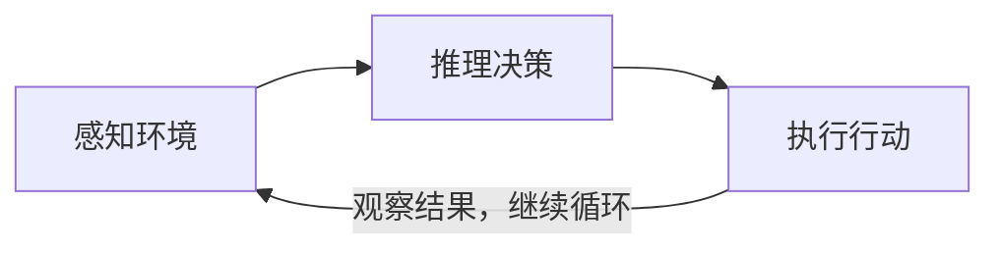
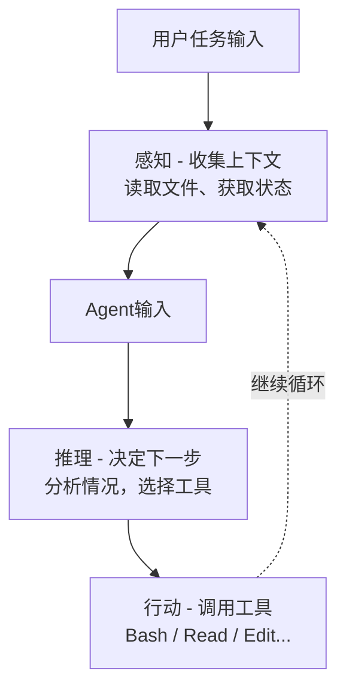

import AgentArchitectureDiagram from '../../components/AgentArchitectureDiagram.astro';

## Agent 架构图

<AgentArchitectureDiagram />

## Agent 架构介绍

### Agent（智能体）
在 AI 应用开发中，`Agent（智能体）`是指能够感知环境、自主做出决策、并采取行动的 AI 系统。

### Agent 架构
`Agent 架构`是指 Agent 系统中各个组件的组织方式，决定了 Agent 的能力边界、可靠性、灵活性和适用场景。

### Agent 的工作方式本质
Agent 的工作方式本质上是一个`循环（Loop）`——感知当前状态，推理下一步，执行行动，再次感知……直到任务完成。

## 常用架构

### 架构一：单 Agent 循环

### 架构二：规划 + 执行（Plan & Execute）
### 架构三：多 Agent 协作（Multi-Agent）
### 架构四：反思与自我修正（Reflection）
### 架构五：RAG + Agent（检索增强型智能体）
### 架构六：工作流编排（Workflow / DAG）
