import AgentArchitectureDiagram from '../../components/AgentArchitectureDiagram.astro';

## 本节导读

  

    

      

        
🎯

        
学习目标

      

      

        Agent 定义
        工作方式本质
        六种架构
        架构选型
      

    

    

      

        
⏱️

        
预计阅读

      

      

        6
        min
      

    

    

      

        
📦

        
你将收获

      

      <ul class="sg-list">
        <li>理解 Agent 的定义与「感知 → 推理 → 行动」循环本质</li>
        <li>掌握六种常见 Agent 架构的原理与适用场景</li>
        <li>学会根据任务复杂度选择合适的架构</li>
      </ul>
    

  

## Agent 架构图

<AgentArchitectureDiagram />

## Agent 架构介绍

### Agent（智能体）
在 AI 应用开发中，`Agent（智能体）`是指能够感知环境、自主做出决策、并采取行动的 AI 系统。

### Agent 架构
`Agent 架构`是指 Agent 系统中各个组件的组织方式，决定了 Agent 的能力边界、可靠性、灵活性和适用场景。

### Agent 的工作方式本质
Agent 的工作方式本质上是一个`循环（Loop）`——感知当前状态，推理下一步，执行行动，再次感知……直到任务完成。

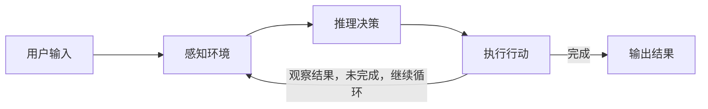

## 常用架构

### 架构一：单 Agent 循环（Single Agent Loop）
1️⃣ 单 Agent 循环简图 
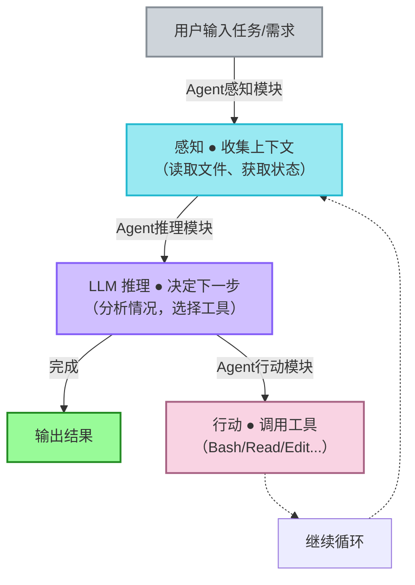
2️⃣ 单 Agent 循环详图
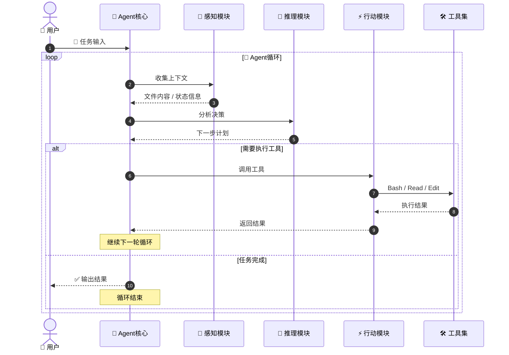
### 架构二：规划 + 执行（Plan & Execute）

1️⃣ 大体流程版本
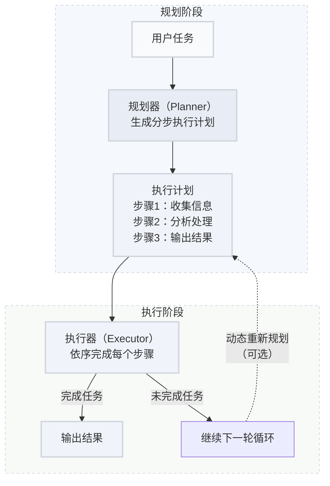

2️⃣ 更清晰的阶段分区版本
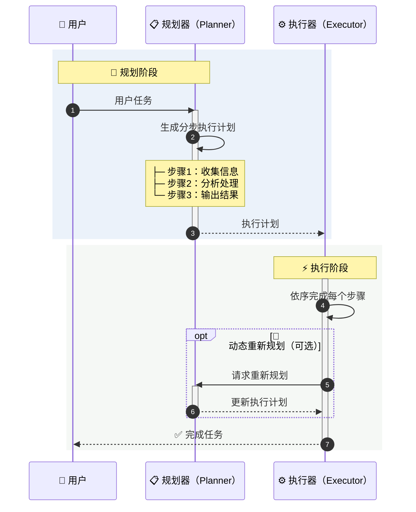

:::tip[规划 + 执行]
Plan & Execute 的代价是增加了推理轮次，对于简单任务反而是一种浪费。如果一个任务可以在 3 步内完成，直接用单 Agent 循环更高效。
:::
### 架构三：多 Agent 协作（Multi-Agent）

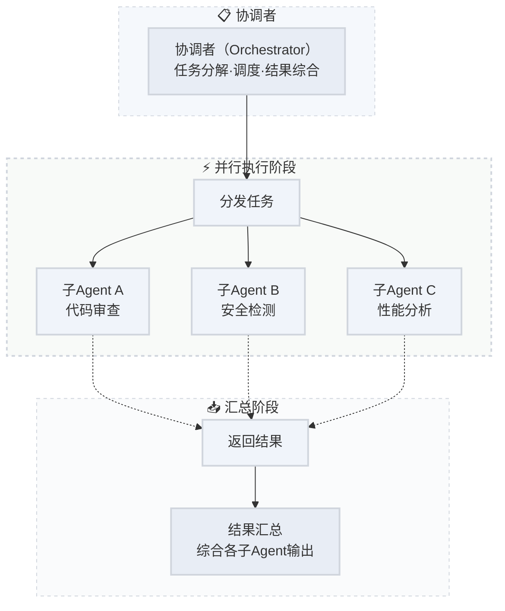
:::tip[子 Agent]
子 Agent（Subagent）是短暂的、隔离的 — 完成一个任务后即销毁。Agent 团队（Agent Teams）则是多个独立 Agent 实例长时间协作、互相发消息，更像一个真实的团队。
:::
### 架构四：反思与自我修正（Reflection）

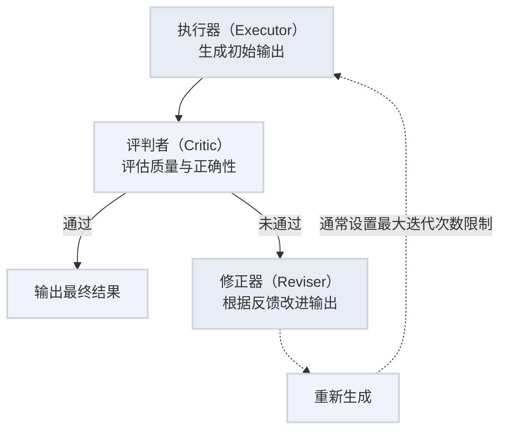
📙 两种实现方式

| 方式        | 机制                               | 优点                       | 缺点                           |
| ----------- | ---------------------------------- | -------------------------- | ------------------------------ |
| 自我反思    | 同一个模型先执行再评估自己的输出   | 实现简单，无额外模型成本   | 模型可能对自己的错误“视而不见” |
| Critic 模型 | 用独立的评判模型评估执行模型的输出 | 更客观，能发现执行模型盲区 | 增加模型调用成本和延迟         |

:::tip[注意事项]
"写单元测试 → 运行测试 → 观察失败 → 修复代码 → 再次运行" — 这就是反思架构的经典应用。测试结果本身就是 Critic 的反馈信号。
:::

### 架构五：RAG + Agent（检索增强型智能体）

1️⃣ Flowchart 图
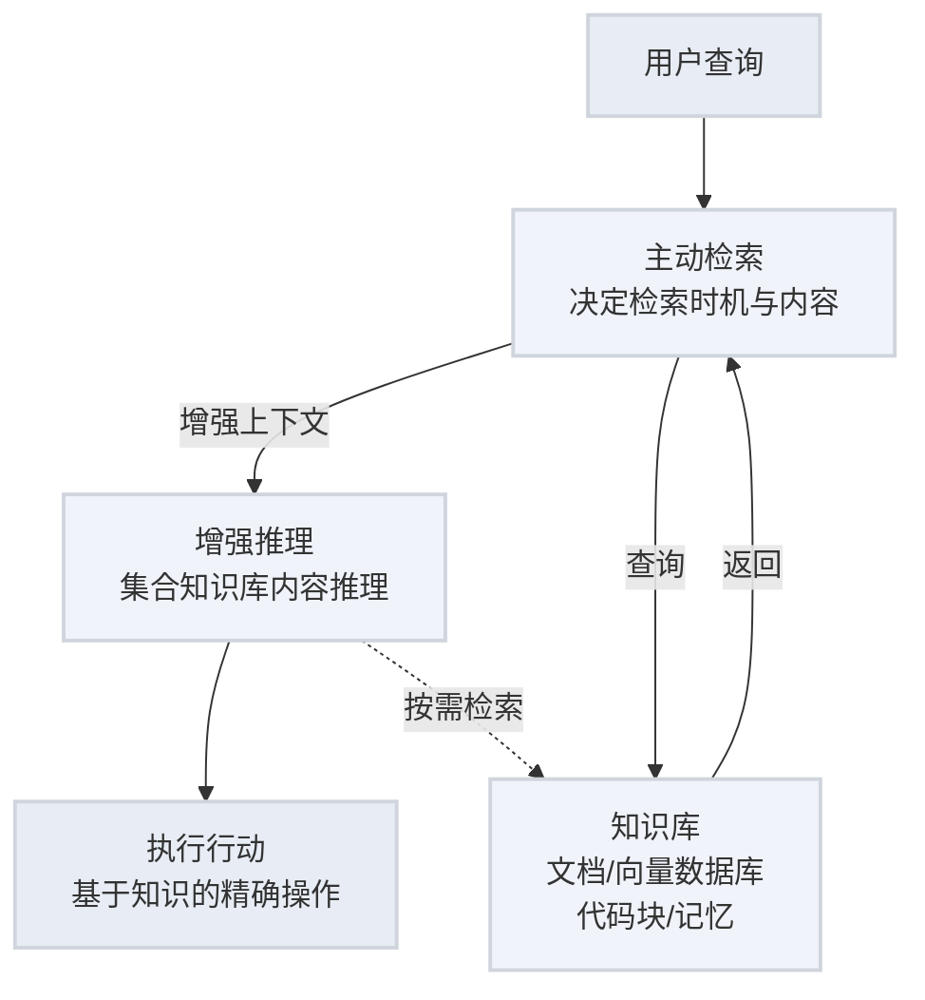

2️⃣ 序列图
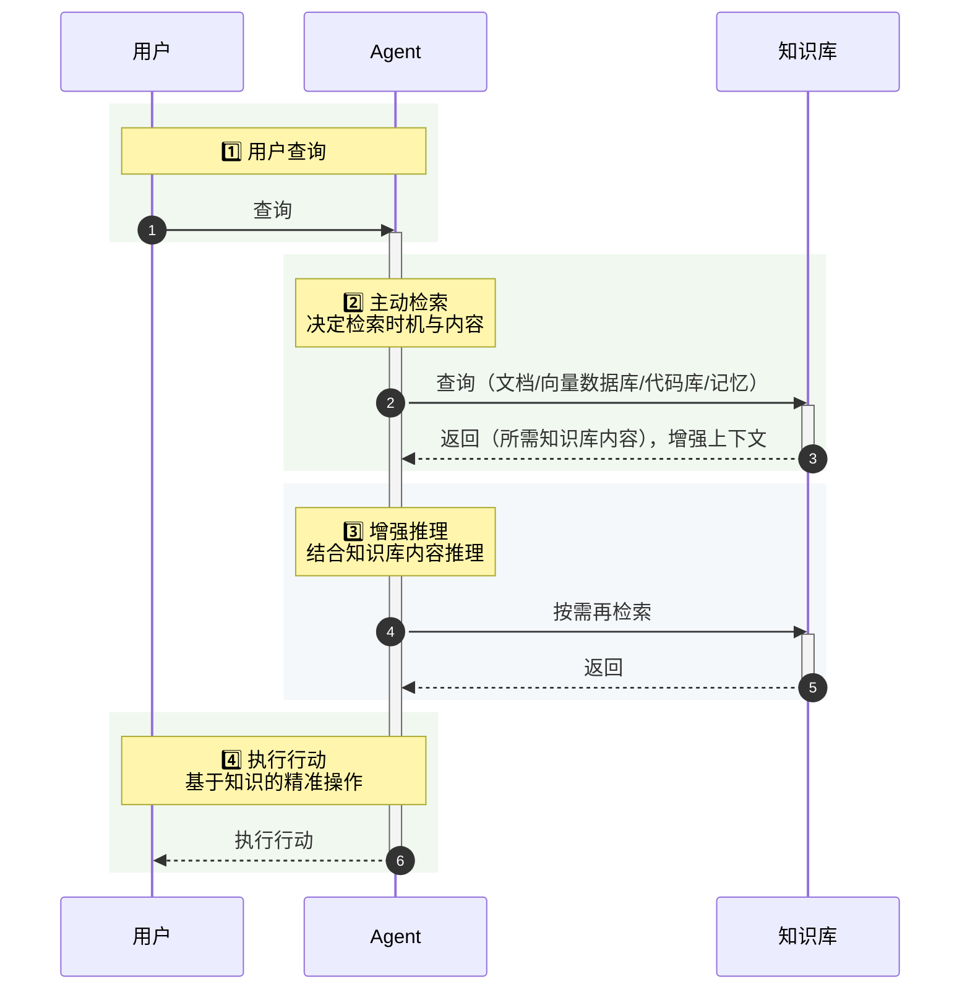

### 架构六：工作流编排（Workflow / DAG）

1️⃣ 流程图

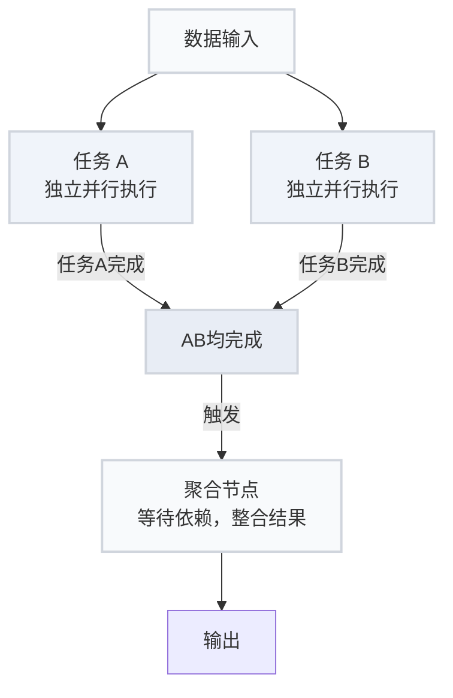

2️⃣ 序列图

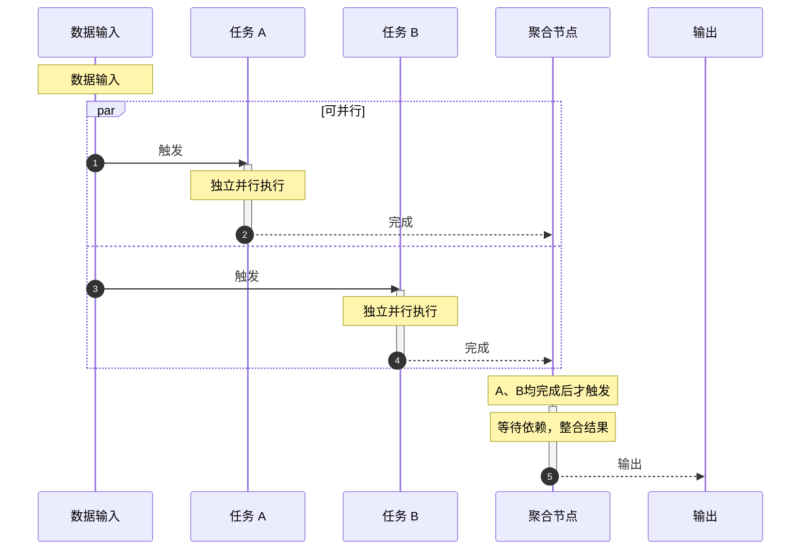