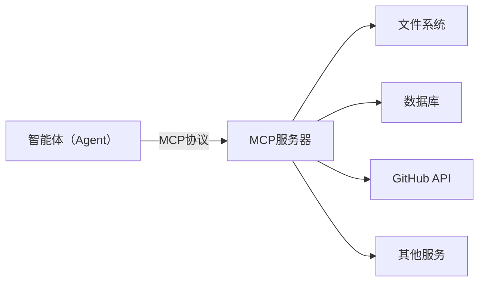
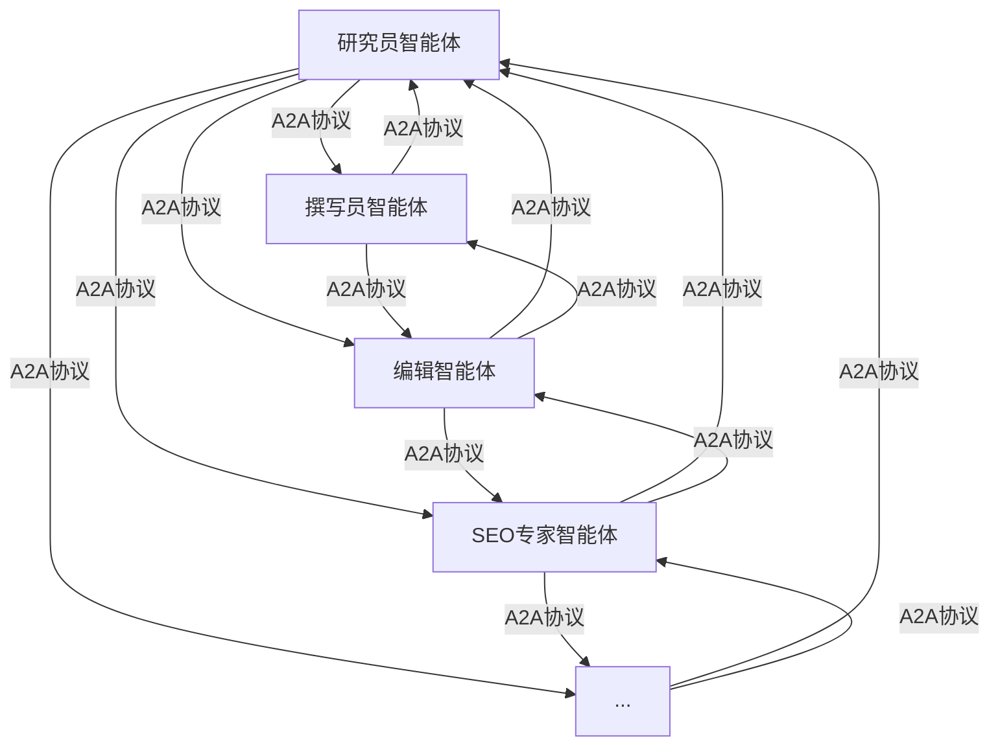
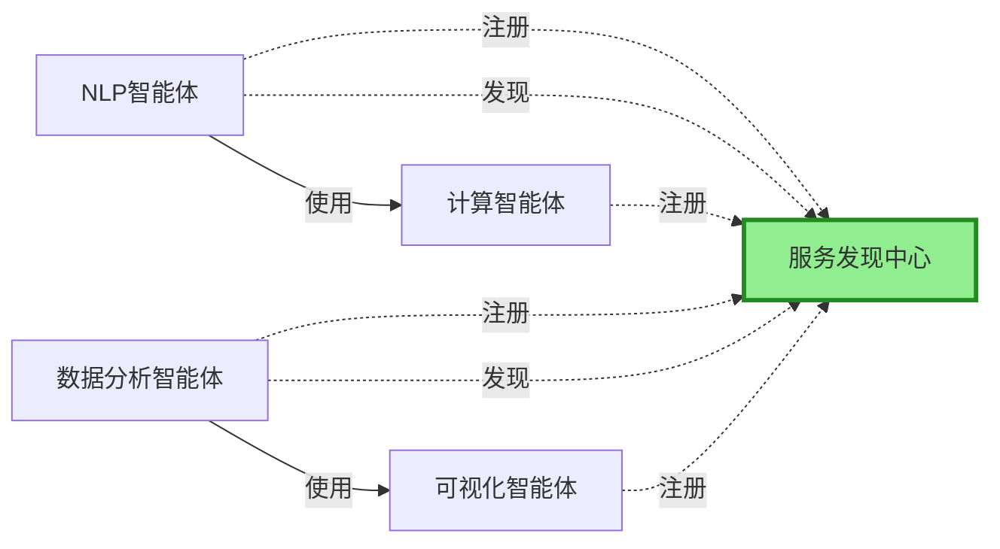

# AI Agent

## 本节导读

<div class="sg-card">
  <div class="sg-body">
    <div class="sg-item">
      <div class="sg-item-head">
        <div class="sg-item-icon">🎯</div>
        <div class="sg-item-label">学习目标</div>
      </div>
      <div class="sg-tags">
        <span class="sg-tag">AI Agent 定义</span>
        <span class="sg-tag">MCP 协议</span>
        <span class="sg-tag">A2A 协议</span>
        <span class="sg-tag">Prompt 工程</span>
      </div>
    </div>
    <div class="sg-item">
      <div class="sg-item-head">
        <div class="sg-item-icon">⏱️</div>
        <div class="sg-item-label">预计阅读</div>
      </div>
      <div class="sg-time">
        <span class="sg-time-num">12</span>
        <span class="sg-time-unit">min</span>
      </div>
    </div>
    <div class="sg-item">
      <div class="sg-item-head">
        <div class="sg-item-icon">📦</div>
        <div class="sg-item-label">你将收获</div>
      </div>
      <ul class="sg-list">
        <li>理解 AI Agent 核心概念</li>
        <li>区分 MCP / A2A / ANP 协议</li>
        <li>编写高质量 Prompt</li>
      </ul>
    </div>
  </div>
</div>

## 定义

> AI Agent (AI 智能体) 是一种通过使用可用工具设计`工作流`来自主执行任务的系统。

## AI Agent 的工作原理

> AI agent (AI 智能体) 的核心是`大语言模型 (LLM)`。因此，AI agent (AI 智能体) 通常被称为 LLM 智能体。
> 传统的 LLM（例如 `IBM® Granite 模型`）根据用于训练它们的数据生成响应，并且受知识和推理限制。
> 相比之下，智能体技术通过`工具调用`在后台获取最新信息、优化工作流并自主创建子任务，从而实现复杂的目标。

## 文档

- [AI Agent 教程](https://www.runoob.com/ai-agent/ai-agent-intro.html)
- [《从零开始构建智能体》](https://github.com/datawhalechina/hello-agents)
- [AI Agent全栈课程](https://github.com/Callous-0923/agent-study)

## 通信协议

### MCP — 智能体与工具的桥梁

1️⃣ 概念

> MCP（Model Context Protocol 模型上下文协议）由 Anthropic 团队提出，其核心设计理念是`标准化智能体与外部工具/资源的通信方式`
> (MCP 是一套开放标准协议，它允许 AI 模型安全、可控地访问外部工具和数据源)

2️⃣ MCP 设计思想



3️⃣ MCP 协议提供了三大核心能力，构成完整的工具访问框架

| 能力            | 说明             | 使用场景            | 示例                             |
| --------------- | ---------------- | ------------------- | -------------------------------- |
| Tools(工具)     | 可执行的功能     | 执行操作/处理数据   | read_file/search_code/send_email |
| Resources(资源) | 可访问的数据     | 读取数据/订阅变化   | 文件内容/数据库记录/API响应      |
| Prompts(提示词) | 预定义的提示版本 | 标准化任务/最佳实践 | 代码审查提示/文档生成提示        |

4️⃣ 三种能力的区别

> - Tools 是主动的（执行操作）
> - Resources 是被动的（提供数据）
> - Prompts 是指导性的（提供模板）。

### A2A — 智能体间的对话

1️⃣ 概念

> A2A（Agent-to-Agent Protocol）协议由 Google 团队提出，其核心设计理念是`实现智能体之间的点对点通信`。
> A2A 关注的是智能体之间如何相互协作。
> A2A 的设计哲学是"对等通信"。在 A2A 网络中，每个智能体既是服务提供者，也是服务消费者。
> 智能体可以主动发起请求，也可以响应其他智能体的请求。这种对等的设计避免了中心化协调器的瓶颈，让智能体网络更加灵活和可扩展。

2️⃣ A2A 设计思想



### ANP - 智能体网络的基础设施

1️⃣ 概念

> ANP（Agent Network Protocol）是一个概念性的协议框架，目前由开源社区维护，还没有成熟的生态，其核心设计理念是`构建大规模智能体网络的基础设施`。
> 如果说 MCP 解决的是"如何访问工具"，A2A 解决的是"如何与其他智能体对话"，那么 ANP 解决的是"如何在大规模网络中发现和连接智能体"。
> ANP 的设计哲学是"去中心化服务发现"。在一个包含成百上千个智能体的网络中，如何让智能体能够找到它需要的服务？
> ANP 提供了服务注册、发现和路由机制，让智能体能够动态地发现网络中的其他服务，而不需要预先配置所有的连接关系。

2️⃣ ANP 设计思想



### 三种协议对比

| 维度         | MCP                           | A2A                    | ANP                        |
| ------------ | ----------------------------- | ---------------------- | -------------------------- |
| **设计目标** | 智能体与工具/资源的标准化通信 | 智能体间的`点对点`通信   | 大规模智能体网络的服务发现 |
| **通信模式** | 客户端/服务器模式（C/S）          | 对等网络（P2P）        | 对等网络（P2P）            |
| **核心理念** | 上下文共享                    | 对等协作               | 去中心化发现               |
| **适用场景** | 访问外部工具和数据源          | 智能体间协作和任务委托   | 大规模智能体生态系统       |
| **扩展性**   | 通过添加MCP服务器扩展         | 通过添加智能体节点扩展 | 支持动态扩展               |
| **实现状态** | 已有成熟实现（FastMCP）       | 官方SDK可用            | 概念性框架                 |

> 如何选择合适的协议？
>
> - 若你的智能体需要访问外部服务（文件、数据库、API）—— 选择 MCP
> - 若你需要多个智能体相互协作完成任务 —— 选择 A2A
> - 若你要构建大规模的智能体生态系统 —— 考虑 ANP

## Prompt（提示词）

1️⃣ 概念

> **提示词（Prompt）**：就是你输入给 AI 模型（比如大型语言模型 LLM，如 GPT-4 或 Gemini）的指令、问题、或文本输入。

### 提示词工具

- [AI 对话提示词](https://www.jyshare.com/front-end/9127/)
- [AI提示词](https://www.aigc.cn/favorites/ai-prompt-keywords)
- [AI提示词生成器](https://promptark.net/zh#generator)
- [提示词优化器](https://promptoptimizer.org/zh)

### Prompt 框架

1️⃣ Prompt 构成元素

```md
- 背景
- 目的
- 风格
- 语气
- 受众
- 输出
```

2️⃣ Prompt 构成元素详解

- **背景**
  > 介绍与任务紧密相关的背景信息。这一环节有助于LLM深入理解讨论的具体环境，从而保证其生成内容与话题高度相关。
- **目的**
  > 明确指出您期望LLM完成的具体任务。通过设定清晰、精确的目标指令，可引导LLM聚焦于实现既定任务，提升输出的有效性。
- **风格**
  > 指定您希望 LLM 输出的写作风格，可以是某个具体名人、具体流派或者某类专家的写作风格。
- **语气**
  > 定义输出内容应有的语气，比如正式、诙谐、温馨、关怀等，以便适应不同的使用场景和使用目的。
- **受众**
  > 明确指出内容面向的读者群体，无论是专业人士、入门学习者还是儿童等，这样LLM就能调整语言和内容深度，使之更加贴合受众需求。
- **输出**
  > 规定输出内容的具体形式，确保LLM提供的成果能直接满足后续应用的需求，比如列表、JSON数据格式、专业分析报告等形式。
