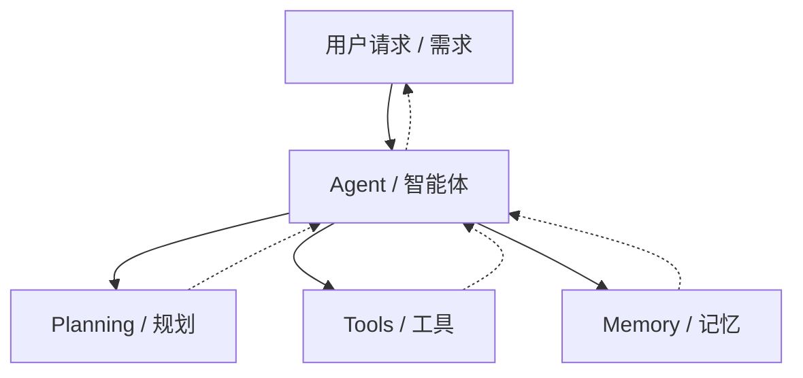
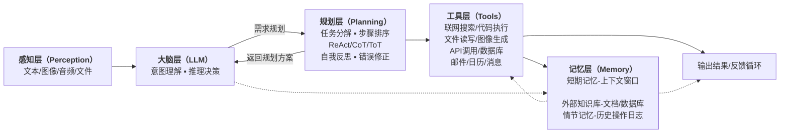
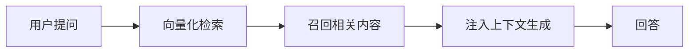
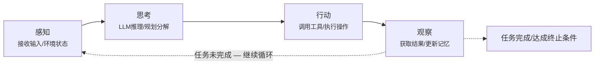
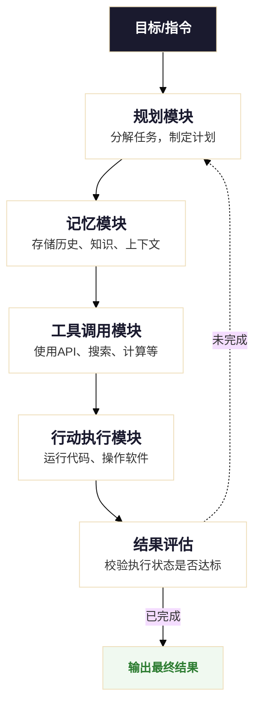
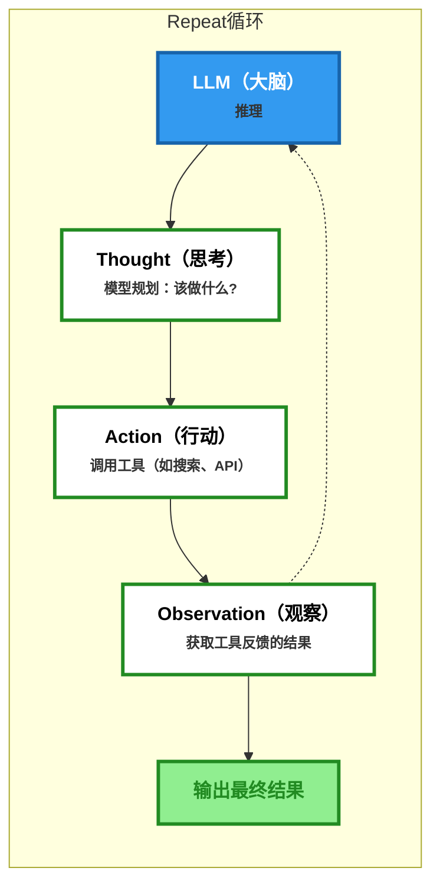

## Agent

`Agent = LLM (大脑) + Planning (规划) + Tool use (执行) + Memory (记忆)`。

### AI Agent 核心组件

📚 详解

- **LLM (大脑)**： 作为核心推理机，负责理解意图、生成文本和进行逻辑判断。
- **Planning (规划)**： 能够将复杂的目标（如"帮我策划一场技术沙龙"）拆解成可执行的步骤。
- **Memory (记忆)**： 记录对话历史（短期）和存储专业知识库（长期）。
- **Tool Use (工具使用)**： 能够根据需求去查谷歌搜索、读数据库、甚至跑 Python 代码。

### AI Agent 五大核心组件

- **感知层（Perception）**：感知 文本、图像、音频、文件
- **大脑层（LLM）**：理解意图-推理决策
- **规划层（Planning）**：任务分解-步骤排序、ReAct/CoT/ToT、自我反思-错误修正
- **工具层（Tools）**：联网搜索/代码执行、文件读写/图像生成、API调用/数据库、邮件/日历/消息
- **记忆层（Memory）**：短期记忆-上下文窗口、长期记忆-向量数据库/RAG、外部知识库-文档/数据库、情节记忆-历史操作日志

1️⃣ AI Agent 五大核心组件职责和关键技术

| 组件       | 核心职责                     | 关键技术                     |
| ---------- | ---------------------------- | ---------------------------- |
| **感知层** | 接收多模态输入，构建上下文   | 多模态模型、OCR、ASR         |
| **大脑**   | 理解意图、推理决策、调用指令 | LLM、Function Calling        |
| **规划**   | 任务分解、步骤排序、自我反思 | ReAct、CoT、ToT、Reflection  |
| **工具**   | 执行具体操作，连接外部世界   | 搜索 / 代码 / API / 文件系统 |
| **记忆**   | 管理上下文、存储长期知识     | 向量数据库、RAG、上下文窗口  |

2️⃣ AI Agent 五大核心组件工作流程

:::tip[流程线]

- **实线**：主流程（任务执行路径）
- **虚线**：记忆层提供的全局支持

:::

### RAG-让 Agent 拥有"外挂知识库"

**检索增强生成（Retrieval-Augmented Generation，RAG）** 是目前最主流的长期记忆实现方案。其核心流程如下

### Agent 运行循环 (Agent Loop)

组成一个持续迭代的`感知—思考—行动—观察`闭环，这就是"Agent Loop"。

## AI Agent 流程

- **规划模块：任务的大脑与指挥官**
  - **任务分解**：将大目标拆解为小步骤。(连接数据/按产品和地区分类/计算环比增长率/生成可视化图表)
  - **反思与调整**：Agent 会评估每一步行动的结果。(若失败了，它会反思原因，并调整计划。)
- **记忆模块：经验的笔记本**
  - **短期记忆**：记住当前对话的上下文，确保回答不跑题。
  - **长期记忆**：将重要的交互信息、学到的知识存储到数据库或向量数据库中，供未来查询和使用，实现越用越聪明。
- **工具调用模块：灵活的双手**
  - 搜索（联网查询）
  - 代码执行（运行执行）
  - 数据库（数据库操作）
  - API 调用（外部服务）
  - ...
- **自我调整**：根据反馈优化策略
- **持续执行**：直到完成任务或遇到无法解决的问题

## Agent vs 传统 AI 模型

| 维度         | 传统 AI 模型         | AI Agent                              |
| ------------ | -------------------- | ------------------------------------- |
| **交互方式** | 单次输入输出         | 多轮对话、持续交互                    |
| **决策能力** | 基于输入直接推理     | 规划、反思、迭代优化、bug修复         |
| **工具使用** | 无法主动调用外部工具 | 可调用搜索、查询知识库、计算器、API等 |
| **记忆机制** | 仅限当前上下文       | 短期+长期记忆                         |
| **目标导向** | 完成单一预测任务     | 完成复杂目标                          |
| **错误处理** | 输出即结束           | 可自我纠错、重试                      |

## 从 Prompt 到 Reasoning Loop

📚 Reasoning Loop详解

- **Thought (思考)**： 模型描述当前要做什么，为什么要这么做。
- **Action (行动)**： 模型选择一个工具（如：Google Search）。
- **Observation (观察)**： 模型读取工具返回的结果。
- **Repeat (循环)**： 重复上述步骤，直到得出最终答案。

## 常见挑战与局限性

:::danger[幻觉问题 (Hallucination)]
Agent 可能生成看似合理但实际错误的信息，需要通过检索增强和验证机制来降低风险。
:::
:::danger[边界失控 (Scope Creep)]
自主性过高可能导致 Agent 执行超出预期范围的操作，需要设置明确的权限边界。
:::
:::danger[成本控制]
多轮迭代调用 LLM 和工具会产生较高成本，需要优化调用策略和缓存机制。
:::
:::danger[安全与隐私]
Agent 可能访问敏感数据，需要实施严格的访问控制和审计机制。
:::

## 最佳实践

:::note[渐进式自主]
从简单任务开始，逐步增加 Agent 的自主权限，循序渐进。
:::
:::note[人工监督]
关键决策节点设置人工审核，平衡效率与安全性。
:::
:::note[持续评估]
建立完善的评估指标体系，定期测试和优化 Agent 表现。
:::
:::note[容错机制]
实现重试、降级、告警等机制，确保系统稳定性。
:::
:::note[权限控制]
手动控制 Agent 的权限，手动审批、自动审批、完全控制等
:::

## 未来发展趋势

:::tip[多模态交互深化]
Agent 将更好地整合视觉、听觉、触觉等多模态感知能力，实现更自然的人机交互。
:::
:::tip[多 Agent 协作系统]
多个专业 Agent 协同工作，形成类似"AI 团队"的组织架构，处理复杂任务。
:::
:::tip[边缘计算部署]
轻量化 Agent 将在手机、IoT 设备等边缘侧运行，实现本地化智能服务。
:::
:::tip[垂直领域深耕]
医疗、法律、金融等专业领域的 Agent 将具备更强的领域知识和推理能力。
:::

## 资源文献

- [AI Agent(智能体) 教程](https://www.runoob.com/ai-agent/ai-agent-tutorial.html)
- [AI Agent 简介](https://www.runoob.com/ai-agent/ai-agent-intro.html)
