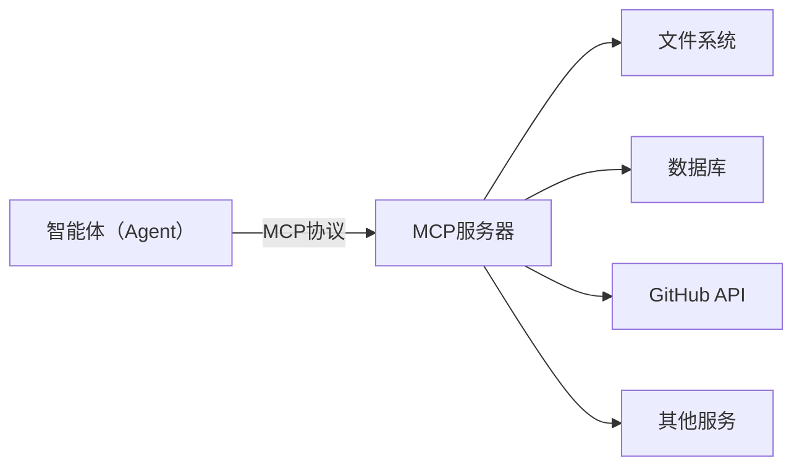
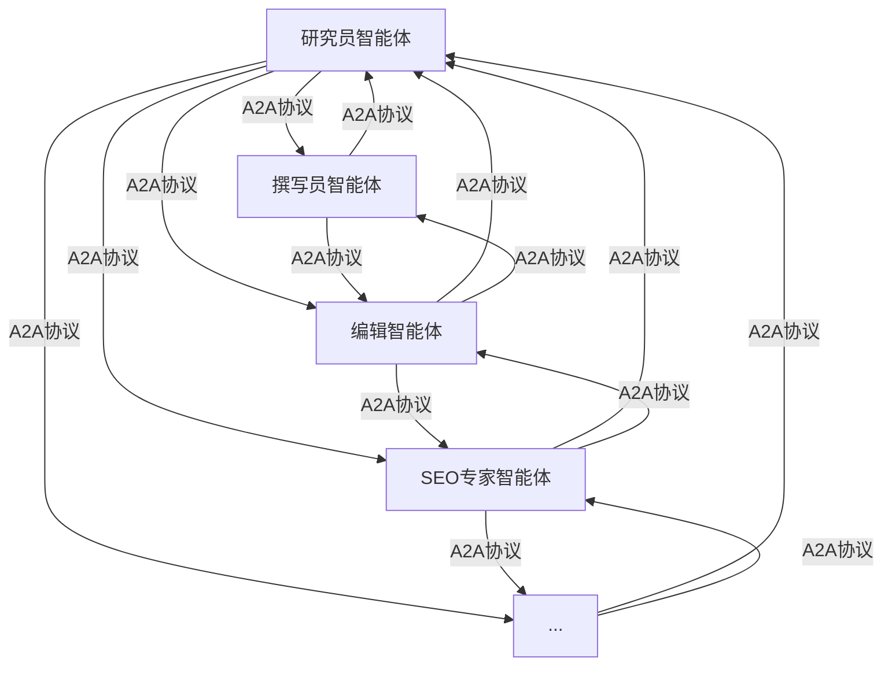
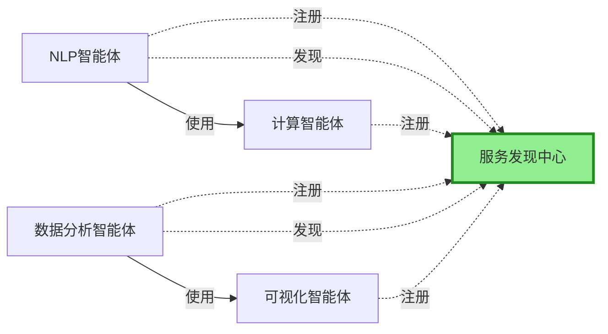

## 本节导读

<div class="sg-card">
  <div class="sg-body">
    <div class="sg-item">
      <div class="sg-item-head">
        <div class="sg-item-icon">🎯</div>
        <div class="sg-item-label">学习目标</div>
      </div>
      <div class="sg-tags">
        <span class="sg-tag">三大协议定位</span>
        <span class="sg-tag">MCP 配置与使用</span>
        <span class="sg-tag">A2A 协作机制</span>
        <span class="sg-tag">协议对比与选型</span>
      </div>
    </div>
    <div class="sg-item">
      <div class="sg-item-head">
        <div class="sg-item-icon">⏱️</div>
        <div class="sg-item-label">预计阅读</div>
      </div>
      <div class="sg-time">
        <span class="sg-time-num">15</span>
        <span class="sg-time-unit">min</span>
      </div>
    </div>
    <div class="sg-item">
      <div class="sg-item-head">
        <div class="sg-item-icon">📦</div>
        <div class="sg-item-label">你将收获</div>
      </div>
      <ul class="sg-list">
        <li>理解 MCP / A2A / ANP 三大协议各自的定位与设计思想</li>
        <li>掌握 MCP 的三大核心能力（Tools / Resources / Prompts）与核心组件</li>
        <li>学会快速配置并使用 MCP 服务器（用户级 / 项目级 / 传输方式）</li>
        <li>掌握 A2A 的三大核心概念与典型应用场景</li>
        <li>学会在 MCP 与 A2A 之间做出选型</li>
      </ul>
    </div>
  </div>
</div>

## 智能体通信协议

### 协议分类

:::tip[MCP：智能体与工具的桥梁]
MCP（Model Context Protocol）由 Anthropic 团队提出，其核心设计理念是**标准化智能体与外部工具/资源的通信方式**。
:::

:::tip[A2A：智能体间的对话协议]
A2A（Agent-to-Agent Protocol）协议由 Google 团队提出，其核心设计理念是**实现智能体之间的点对点通信**。
:::

:::tip[ANP：智能体网络的基础设施]
ANP（Agent Network Protocol）是一个概念性的协议框架，其核心设计理念是**构建大规模智能体网络的基础设施**。
:::

### MCP — 智能体与工具的桥梁

1️⃣ 概念

> MCP（Model Context Protocol 模型上下文协议）由 Anthropic 团队提出，其核心设计理念是`标准化智能体与外部工具/资源的通信方式`
> (MCP 是一套开放标准协议，它允许 AI 模型安全、可控地访问外部工具和数据源)

2️⃣ MCP 设计思想



3️⃣ MCP 协议提供了三大核心能力，构成完整的工具访问框架

| 能力            | 说明             | 使用场景            | 示例                             |
| --------------- | ---------------- | ------------------- | -------------------------------- |
| Tools(工具)     | 可执行的功能     | 执行操作/处理数据   | read_file/search_code/send_email |
| Resources(资源) | 可访问的数据     | 读取数据/订阅变化   | 文件内容/数据库记录/API响应      |
| Prompts(提示词) | 预定义的提示版本 | 标准化任务/最佳实践 | 代码审查提示/文档生成提示        |

4️⃣ 三种能力的区别
- Tools 是主动的（执行操作）
- Resources 是被动的（提供数据）
- Prompts 是指导性的（提供模板）。

### A2A — 智能体间的对话

1️⃣ 概念

> A2A（Agent-to-Agent Protocol）协议由 Google 团队提出，其核心设计理念是`实现智能体之间的点对点通信`。
> A2A 关注的是智能体之间如何相互协作。
> A2A 的设计哲学是"对等通信"。在 A2A 网络中，每个智能体既是服务提供者，也是服务消费者。
> 智能体可以主动发起请求，也可以响应其他智能体的请求。这种对等的设计避免了中心化协调器的瓶颈，让智能体网络更加灵活和可扩展。

2️⃣ A2A 设计思想



### ANP - 智能体网络的基础设施

1️⃣ 概念

> ANP（Agent Network Protocol）是一个概念性的协议框架，目前由开源社区维护，还没有成熟的生态，其核心设计理念是`构建大规模智能体网络的基础设施`。
> 如果说 MCP 解决的是"如何访问工具"，A2A 解决的是"如何与其他智能体对话"，那么 ANP 解决的是"如何在大规模网络中发现和连接智能体"。
> ANP 的设计哲学是"去中心化服务发现"。在一个包含成百上千个智能体的网络中，如何让智能体能够找到它需要的服务？
> ANP 提供了服务注册、发现和路由机制，让智能体能够动态地发现网络中的其他服务，而不需要预先配置所有的连接关系。

2️⃣ ANP 设计思想



### 三种协议对比

| 维度         | MCP                           | A2A                    | ANP                        |
| ------------ | ----------------------------- | ---------------------- | -------------------------- |
| **设计目标** | 智能体与工具/资源的标准化通信 | 智能体间的`点对点`通信   | 大规模智能体网络的服务发现 |
| **通信模式** | 客户端/服务器模式（C/S）          | 对等网络（P2P）        | 对等网络（P2P）            |
| **核心理念** | 上下文共享                    | 对等协作               | 去中心化发现               |
| **适用场景** | 访问外部工具和数据源          | 智能体间协作和任务委托   | 大规模智能体生态系统       |
| **扩展性**   | 通过添加MCP服务器扩展         | 通过添加智能体节点扩展 | 支持动态扩展               |
| **实现状态** | 已有成熟实现（FastMCP）       | 官方SDK可用            | 概念性框架                 |

> 如何选择合适的协议？
>
> - 若你的智能体需要访问外部服务（文件、数据库、API）—— 选择 MCP
> - 若你需要多个智能体相互协作完成任务 —— 选择 A2A
> - 若你要构建大规模的智能体生态系统 —— 考虑 ANP

## MCP 协议

### 为什么使用 MCP

> MCP 解决了**AI 如何连接工具**的问题，让 AI 应用可以调用外部工具、读取资源数据、使用预定义提示，就像给 AI 装上了"手"和"眼睛"。

#### 无 MCP 的 Claude Code

```sh
你能做的：
✓ 读取本地文件
✓ 编辑代码
✓ 运行命令
✓ 使用 Bash 工具

你不能做的：
✗ 查看你的 GitHub Issues
✗ 访问云数据库
✗ 调用外部 API
✗ 获取实时天气
```

#### 有 MCP 的 Claude Code

```sh
你能做的：
✓ 所有原来的功能
✓ 查看/创建 GitHub Issues 和 PR
✓ 查询 SQLite、PostgreSQL 数据库
✓ 访问 Notion、Slack 等外部服务
✓ 获取实时天气、地图数据
✓ 浏览器自动化
✓ ...以及更多！
```

### MCP

#### MCP是什么

> MCP（Model Context Protocol  模型上下文协议）是 Anthropic 于 2024 年 11 月推出的**AI 与外部工具连接的统一标准**。
> 它让 AI 应用可以调用外部工具、读取资源数据、使用预定义提示，就像给 AI 装上了"手"和"眼睛"。

#### 如何使用 MCP 

| 步骤                | 说明                                                 |
| ------------------- | ---------------------------------------------------- |
| **1. 开发 MCP Server**  | 按 MCP 规范实现 Server，提供 tools/resources/prompts |
| **2. 配置 AI 应用连接** | 在 AI 应用中添加 MCP Server 配置（本地或远程）       |
| **3. AI 自动调用**      | AI 根据任务需求，自动发现并调用合适的工具或读取资源  |

#### MCP 三大核心能力

| 能力     | 英文      | 作用              | 示例                                |
| -------- | --------- | ----------------- | ----------------------------------- |
| **工具** | Tools     | AI 可以调用的功能 | 查询天气、发送邮件、调用 API 等工具 |
| **资源** | Resources | AI 可以读取的数据 | 文件内容、数据库记录、配置信息等    |
| **提示** | Prompts   | 预定义的提示模板  | 代码审查模板、写作模板              |

#### MCP 的核心组件

MCP 的架构主要包括三个部分

- `MCP Host` —— 通常是 AI 模型（如 Claude等）或 Agent 的运行环境，负责发起请求。
- `MCP Client` —— Host 的代理层，处理与 Server 的通信。
- `MCP Server` —— 工具或数据源的提供端，通过标准化接口暴露资源和功能。

#### MCP 的典型应用场景

| 场景         | 说明                    | 示例                     |
| ------------ | ----------------------- | ------------------------ |
| **本地文件操作**| 让 AI 读取/修改本地文件 | 读取代码库、分析日志文件 |
| **数据库查询**| 让 AI 直接查询数据库    | SQL 查询、数据分析       |
| **API 调用**| 让 AI 调用第三方服务    | GitHub API、Slack、邮件  |
| **开发工具集成**| 让 AI 使用开发工具      | Git 操作、终端命令       |

### 快速开始

#### 1. 了解配置文件位置

Claude Code 的 MCP 配置文件位于

| 级别   | 配置文件路径     | 作用范围 |
| ------ | ---------------- | -------- |
| 用户级 | `~/.claude.json`   | 所有项目 |
| 项目级 | `.claude/mcp.json` | 当前项目 |

> 推荐优先使用项目级配置，让不同项目使用不同的 MCP 服务。

#### 2. 用自然语言添加 MCP 服务器
1️⃣ 配置文件位置
```sh
.claude/mcp.json
```

2️⃣ 自然语言创建 MCP 服务器
```md
输入：帮我添加 GitHub MCP 服务器，我的 token 是 ghp_xxx
```

#### 3. 验证配置

1️⃣ 直接询问 Claude Code

```sh
input：现在有哪些可用的 MCP 服务器？

Claude：当前已配置的 MCP 服务器
• github - GitHub 集成
• sqlite - SQLite 数据库
• filesystem - 文件系统访问
```

2️⃣ 使用诊断命令

```sh
/doctor
```

#### 4. 开始使用
> 配置成功后，直接用自然语言调用 MCP 功能

### 配置方式详解
#### 用户级配置（全局）

1️⃣ 配置文件 `~/.claude.json`

```json 
{
  "mcpServers": {
    "filesystem": {
      "command": "npx",
      "args": ["-y", "@modelcontextprotocol/server-filesystem", "/Users/yourname/Documents"]
    },
    "github": {
      "command": "npx",
      "args": ["-y", "@modelcontextprotocol/server-github"],
      "env": {
        "GITHUB_PERSONAL_ACCESS_TOKEN": "your-token"
      }
    }
  }
}
```
#### 项目级配置（推荐）

1️⃣ 配置文件 `.claude/mcp.json`

```json
{
  "mcpServers": {
    "project-db": {
      "command": "npx",
      "args": ["-y", "@modelcontextprotocol/server-sqlite", "--db-path", "./data/app.db"]
    }
  }
}
```

2️⃣ 项目级配置优势
- 团队成员可以共享配置（提交到 Git）
- 不同项目使用不同的 MCP 服务
- 配置更灵活，不会污染全局设置

#### 传输方式配置
- STDIO（本地进程）
- HTTP（远程服务）
- SSE（服务器推送）

### MCP 服务器资源

| 来源                            | 地址                                                                              |
| ------------------------------- | --------------------------------------------------------------------------------- |
| 官方 Server 列表                | [Model Context Protocol Servers](https://github.com/modelcontextprotocol/servers) |
| 官方 MCP 注册                   | [Model Context Protocol Registry](https://modelcontextprotocol.io)                |
| MCP.so（中文）                  | [MCP.so](https://mcp.so)                                                          |
| LobeHub MCP（中文）             | [LobeHub MCP](https://lobehub.com/mcp)                                            |
| Pulse MCP（英文）               | [Pulse MCP](https://pulsemcp.com)                                                 |
| Smithery（英文）                | [Smithery](https://smithery.ai)                                                   |
| Awesome MCP Servers（精选汇总） | [Awesome MCP Servers](https://github.com/awesome-mcp-servers)                     |
| 精选的优秀 MCP 服务器列表        | [awesome-mcp-servers](https://glama.ai/mcp/servers)                     |

## A2A 协议

### 什么是 A2A 协议
A2A（Agent-to-Agent Protocol）是 Google 于 2025 年 4 月推出的**Agent 之间相互协作的通信标准**。
它让不同厂商、不同框架的 Agent 能够相互发现、分配任务、交换信息，就像给 AI 世界装上了"对讲机"。

### 为什么使用 A2A

A2A（Agent-to-Agent Protocol）解决**多个 Agent 如何协作的问题**，让不同厂商、不同框架的 Agent 能够相互发现、分配任务、交换信息。

### 什么时候用 A2A

> **当需要多个 Agent 协作完成复杂任务时** <br>
> 一个 Agent 负责需求分析，一个负责写代码，一个负责测试，各自发挥专长  

> **当需要集成不同厂商的 Agent 时** <br>
> Google 的 Agent、Anthropic 的 Agent、OpenAI 的 Agent 需要相互协作等 

> **当需要任务委托和进度追踪时** <br>
> 主 Agent 分配任务给专家 Agent，并实时接收进度更新

### 如何使用 A2A

| 步骤              | 说明                                                  |
| ----------------- | ----------------------------------------------------- |
| 1️⃣ 发布 Agent Card | 在 `/.well-known/agent.json` 路径暴露 Agent 的能力描述  |
| 2️⃣ 发现 Agent      | 通过 `agents/get` API 获取其他 Agent 的名片，了解其能力 |
| 3️⃣ 发送任务        | 通过 `tasks/send` API 发送任务，支持 SSE 接收进度更新   |
| 4️⃣ 获取结果        | 任务完成后，通过 `tasks/get` API 获取最终结果           |

### A2A 三大核心概念

| 概念       | 英文       | 作用                 | 类比     |
| ---------- | ---------- | -------------------- | -------- |
| Agent Card | Agent 名片 | 描述 Agent 的能力    | 员工工牌 |
| Task       | 任务       | 要执行的工作单元     | 工单     |
| Message    | 消息       | Agent 之间的通信内容 | 聊天记录 |

### A2A 的典型应用场景

| 场景       | 说明                        | 示例                               |
| ---------- | --------------------------- | ---------------------------------- |
| 软件开发   | 多 Agent 协作完成开发任务   | 需求分析→代码→测试→部署            |
| 企业工作流 | 不同部门 Agent 协作处理业务 | HR Agent + 财务 Agent + 法务 Agent |
| 智能客服   | 多个专业 Agent 分工处理     | 接待→解答→转接→记录                |
| 数据分析   | 多个 Agent 协作分析数据     | 收集→清洗→分析→可视化→报告         |

## MCP vs A2A

### 对比维度
AI Agent 两大协议的定位差异

| 对比维度     | MCP                                                  | A2A                                                   |
| ------------ | ---------------------------------------------------- | ----------------------------------------------------- |
| **定位**     | AI 与外部工具、数据源的连接协议                      | Agent 之间的通信协议                                  |
| **发起方**   | Anthropic                                            | Google                                                |
| **发布时间** | 2024.11                                              | 2025.04                                               |
| **架构**     | Client-Server                                        | Peer-to-Peer                                          |
| **数据格式** | JSON-RPC 2.0                                         | HTTP + JSON                                           |
| **核心作用** | 让工具开发者写一次代码，所有 AI 应用都能用           | 让不同厂商、不同框架的 Agent 能够无缝协作             |
| **类比**     | typeC，统一各种设备的充电方式                 | 企业微信，让同事之间可以发任务、聊天                |
| **类比场景** | 商场的"统一插座标准"，让各种电器（工具）都能插上使用 | 商场的"内部对讲系统"，让不同店铺（Agent）之间可以协作 |


> **核心思想** <br>
> MCP 和 A2A 不是竞争关系，而是互补关系。MCP 解决"AI 如何获取外部能力"，A2A 解决"多个 AI 如何协作"。

### 如何选择

| 场景                                    | 选择          |
| --------------------------------------- | ------------- |
| 让 AI 调用本地函数或工具                | Function Call |
| 使用第三方工具（数据库、API、文件系统） | MCP           |
| 构建多 Agent 协作系统                   | A2A           |
| 同时需要工具集成和多 Agent 协作         | MCP + A2A     |

## 资料文献

- [AI Agent 教程](https://www.runoob.com/ai-agent/ai-agent-intro.html)
- [《从零开始构建智能体》](https://github.com/datawhalechina/hello-agents)
- [AI Agent全栈课程](https://github.com/Callous-0923/agent-study)