import AgentArchitectureDiagram from '../../components/AgentArchitectureDiagram.astro';

## Agent

`Agent = LLM (大脑) + Planning (规划) + Tool use (执行) + Memory (记忆)`。

### AI Agent 核心组件

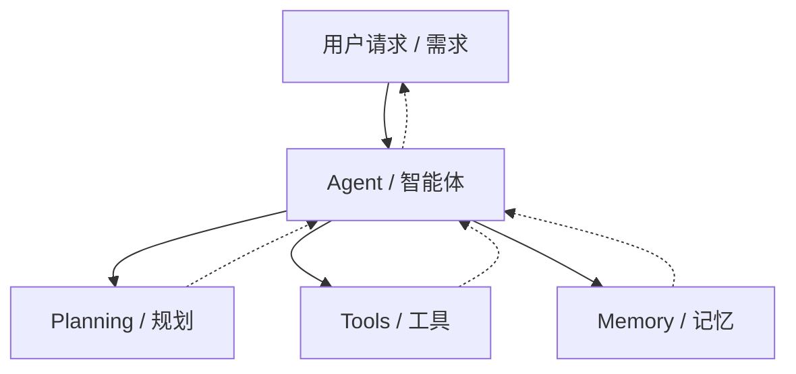

📚 详解

- **LLM (大脑)**： 作为核心推理机，负责理解意图、生成文本和进行逻辑判断。
- **Planning (规划)**： 能够将复杂的目标（如"帮我策划一场技术沙龙"）拆解成可执行的步骤。
- **Memory (记忆)**： 记录对话历史（短期）和存储专业知识库（长期）。
- **Tool Use (工具使用)**： 能够根据需求去查谷歌搜索、读数据库、甚至跑 Python 代码。

### AI Agent 五大核心组件

- **感知层（Perception）**：感知 文本、图像、音频、文件
- **大脑层（LLM）**：理解意图-推理决策
- **规划层（Planning）**：任务分解-步骤排序、ReAct/CoT/ToT、自我反思-错误修正
- **工具层（Tools）**：联网搜索/代码执行、文件读写/图像生成、API调用/数据库、邮件/日历/消息
- **记忆层（Memory）**：短期记忆-上下文窗口、长期记忆-向量数据库/RAG、外部知识库-文档/数据库、情节记忆-历史操作日志

1️⃣ AI Agent 五大核心组件职责和关键技术

| 组件       | 核心职责                     | 关键技术                     |
| ---------- | ---------------------------- | ---------------------------- |
| **感知层** | 接收多模态输入，构建上下文   | 多模态模型、OCR、ASR         |
| **大脑**   | 理解意图、推理决策、调用指令 | LLM、Function Calling        |
| **规划**   | 任务分解、步骤排序、自我反思 | ReAct、CoT、ToT、Reflection  |
| **工具**   | 执行具体操作，连接外部世界   | 搜索 / 代码 / API / 文件系统 |
| **记忆**   | 管理上下文、存储长期知识     | 向量数据库、RAG、上下文窗口  |

2️⃣ AI Agent 五大核心组件工作流程

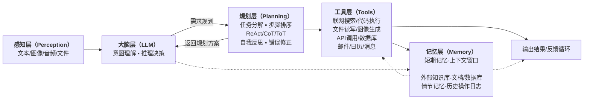

:::tip[流程线]

- **实线**：主流程（任务执行路径）
- **虚线**：记忆层提供的全局支持

:::

### RAG-让 Agent 拥有"外挂知识库"

**检索增强生成（Retrieval-Augmented Generation，RAG）** 是目前最主流的长期记忆实现方案。其核心流程如下

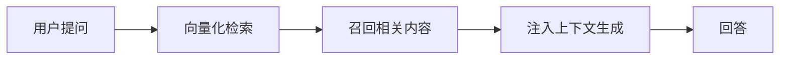

### Agent 运行循环 (Agent Loop)

组成一个持续迭代的`感知—思考—行动—观察`闭环，这就是"Agent Loop"。

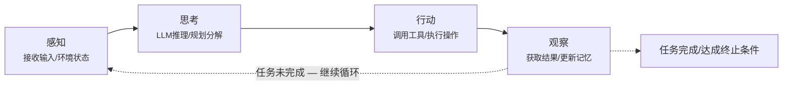

## Agent 架构

### Agent 架构图

<AgentArchitectureDiagram />

### Agent 架构介绍

#### Agent（智能体）

在 AI 应用开发中，`Agent（智能体）`是指能够感知环境、自主做出决策、并采取行动的 AI 系统。

#### Agent 架构

`Agent 架构`是指 Agent 系统中各个组件的组织方式，决定了 Agent 的能力边界、可靠性、灵活性和适用场景。

#### Agent 的工作方式本质

Agent 的工作方式本质上是一个`循环（Loop）`——感知当前状态，推理下一步，执行行动，再次感知……直到任务完成。

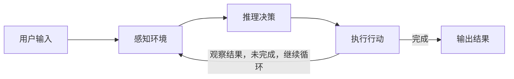

### 常用架构

#### 架构一：单 Agent 循环（Single Agent Loop）

1️⃣ 单 Agent 循环简图

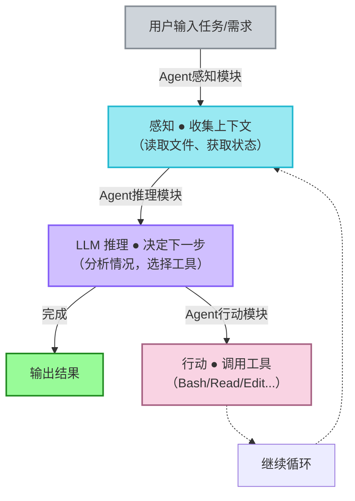

2️⃣ 单 Agent 循环详图

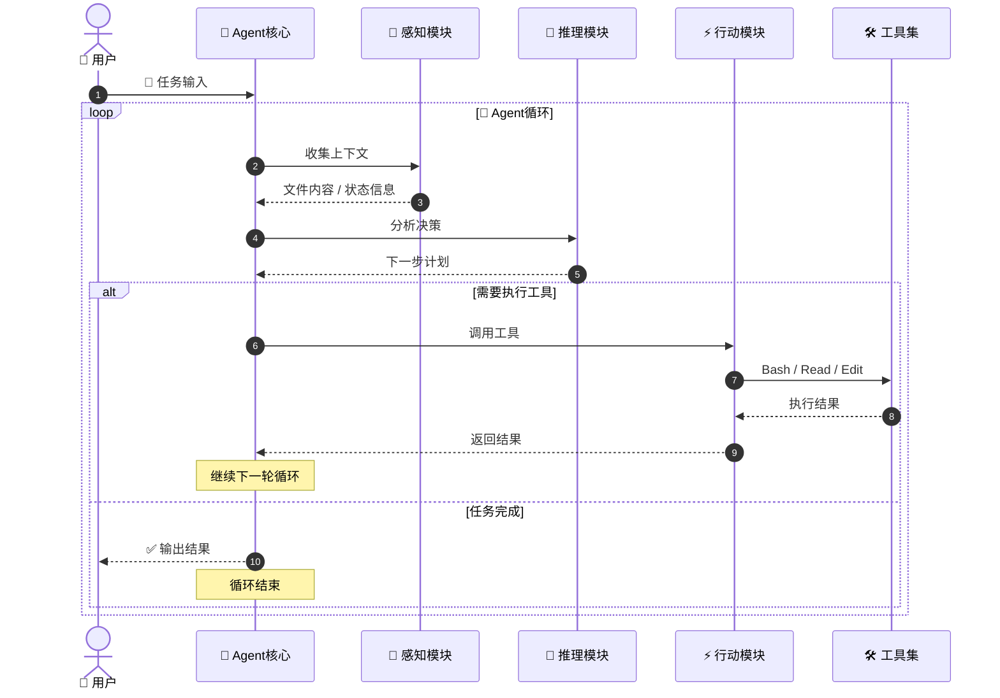

#### 架构二：规划 + 执行（Plan & Execute）

1️⃣ 大体流程版本

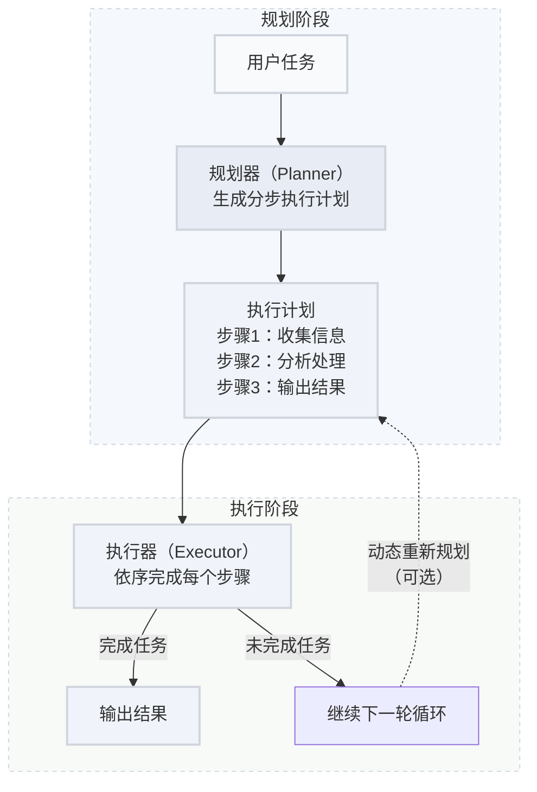

2️⃣ 更清晰的阶段分区版本

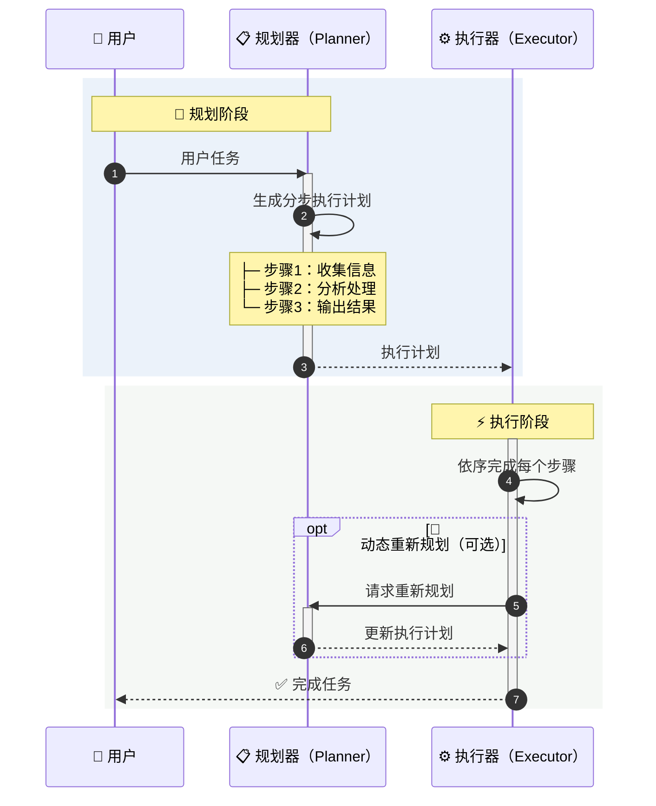

:::tip[规划 + 执行]
Plan & Execute 的代价是增加了推理轮次，对于简单任务反而是一种浪费。如果一个任务可以在 3 步内完成，直接用单 Agent 循环更高效。
:::

#### 架构三：多 Agent 协作（Multi-Agent）

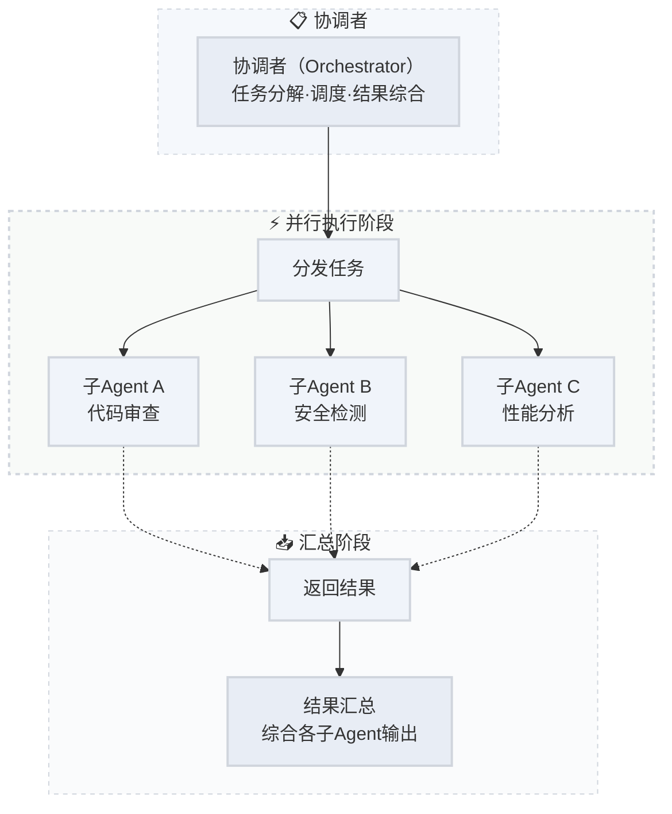

:::tip[子 Agent]
子 Agent（Subagent）是短暂的、隔离的 — 完成一个任务后即销毁。Agent 团队（Agent Teams）则是多个独立 Agent 实例长时间协作、互相发消息，更像一个真实的团队。
:::

#### 架构四：反思与自我修正（Reflection）

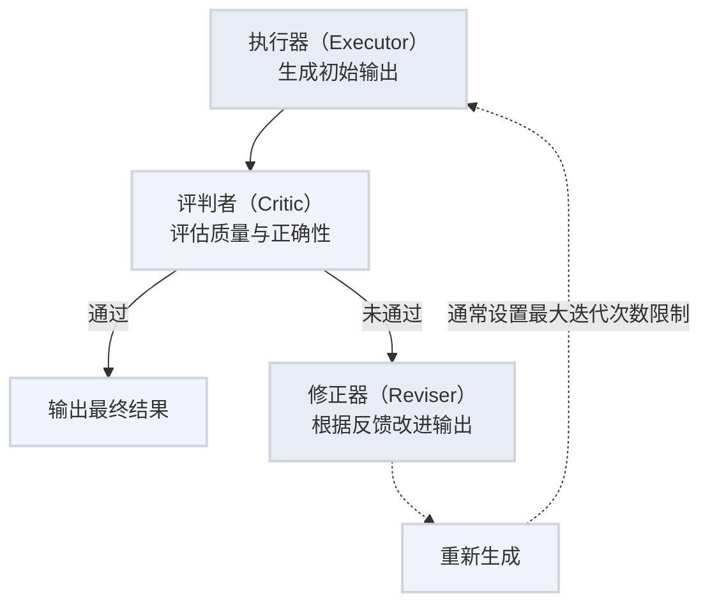

📙 两种实现方式

| 方式        | 机制                               | 优点                       | 缺点                           |
| ----------- | ---------------------------------- | -------------------------- | ------------------------------ |
| 自我反思    | 同一个模型先执行再评估自己的输出   | 实现简单，无额外模型成本   | 模型可能对自己的错误“视而不见” |
| Critic 模型 | 用独立的评判模型评估执行模型的输出 | 更客观，能发现执行模型盲区 | 增加模型调用成本和延迟         |

:::tip[注意事项]
"写单元测试 → 运行测试 → 观察失败 → 修复代码 → 再次运行" — 这就是反思架构的经典应用。测试结果本身就是 Critic 的反馈信号。
:::

#### 架构五：RAG + Agent（检索增强型智能体）

1️⃣ Flowchart 图

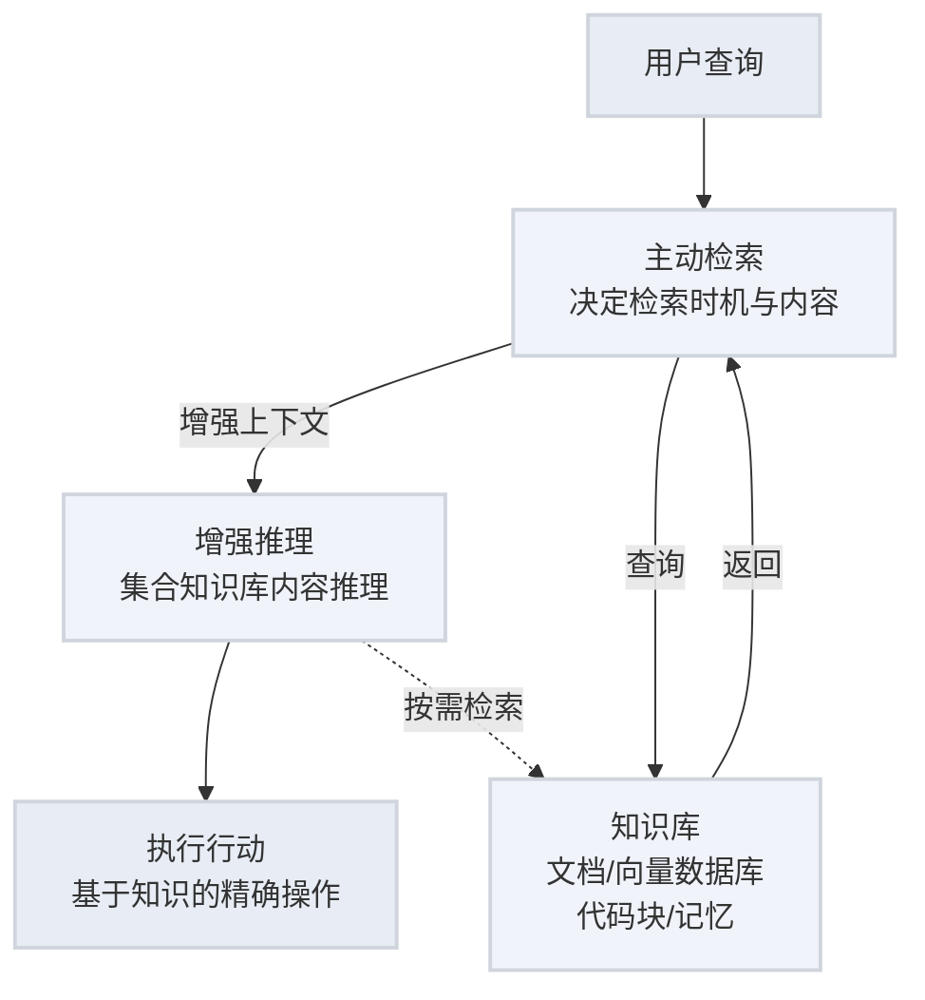

2️⃣ 序列图

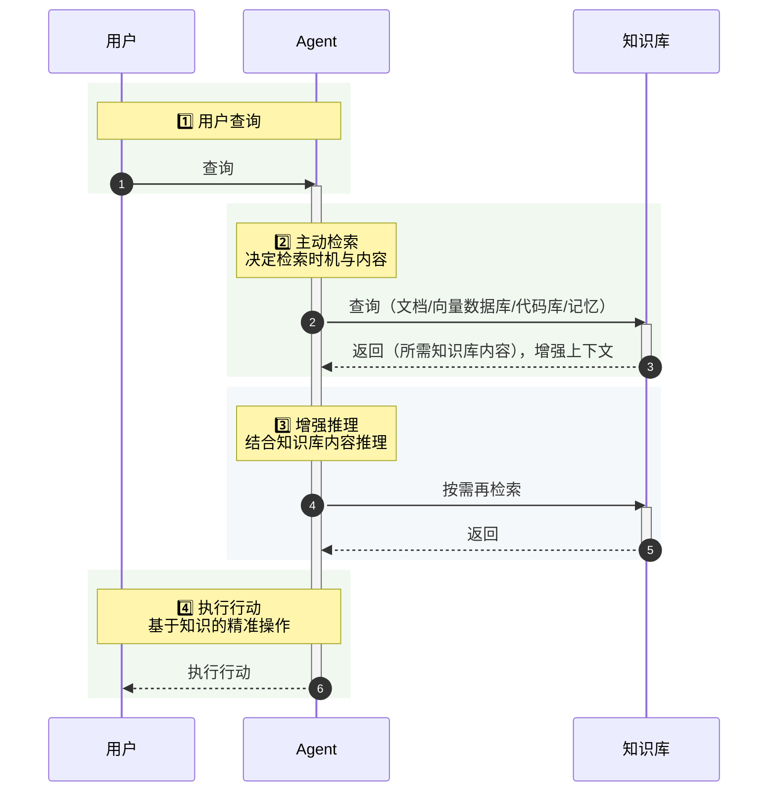

#### 架构六：工作流编排（Workflow / DAG）

1️⃣ 流程图

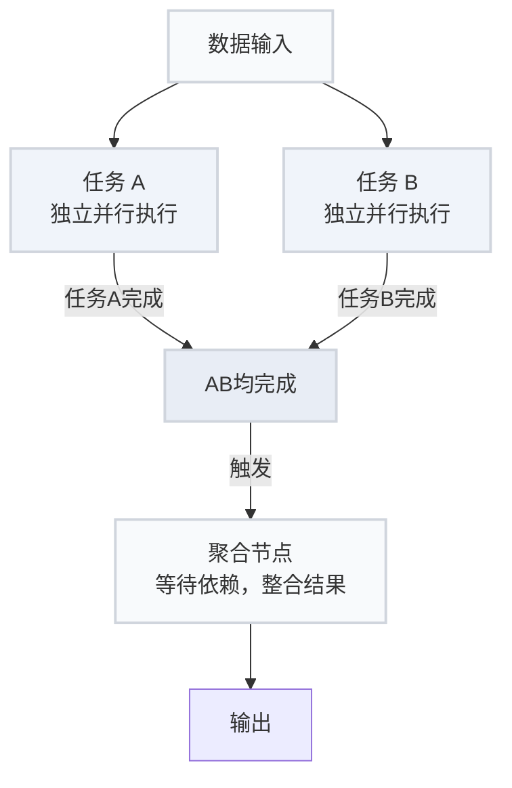

2️⃣ 序列图

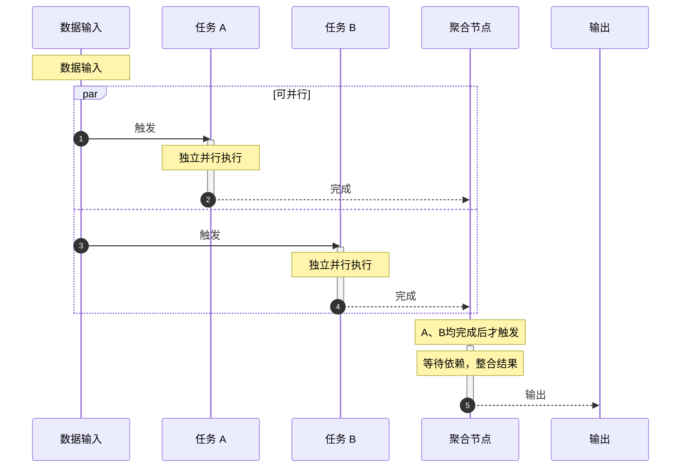

## AI底层框架全景图

- `应用层（行动）`： **面向用户的特定技能与行为**，实现复杂任务的自动化执行
  :::tip[Agent Skill（定制化技能）]
  领域知识 | 业务流程 | 任务编排 | 行动指令
  :::
- `智能体层（决策）`：**自主决策与任务规划**，感知环境、制定计划、执行行动，形成闭环控制
  :::tip[Agent（自主大脑）]
  Export（探索） | Plan（规划） | Act（行动）
  :::
- `能力扩展层（工具）`：**连接外部工具与服务**，扩展模型能力，访问真实世界数据与服务
  :::tip[MCP（能力拓展层）]
  搜索引擎 | 代码解读器 | API调用 | 数据库 | 更多工具
  :::
- `上下文层（记忆）`：**整合与管理上下文信息**，记忆存在、检索与增强、提升回答准确与连贯性
  :::tip[Context Window（记忆加工）]
  - Prompt（用户）：意图理解 | 指令封装 | 上下文构建
  - Memory（记忆管理）：短期记忆 | 长期记忆 | 对话历史 | 状态跟踪
  - RAG（外部知识库）：检索增强 | 向量检索 | 知识融合
    :::
- `基础层（模型）`：**AI 能力的基石**，提供语言理解与生成能力，处理和生成Token序列
  :::tip[LLM & Token（基础模型与令牌层）]
  Transfomer架构 | 预训练模型 | Token化 | 位置编码 | 注意力机制
  :::

### 核心名词释义

| 概念             | 说明                                                                                   |
| :--------------- | :------------------------------------------------------------------------------------- |
| **Transformer**  | 当前大模型核心架构，通过自注意力机制建立 Token 之间关联关系。                          |
| **Token**        | 模型处理文本最小单位，可为字词、单词、字符或符号。                                     |
| **Prompt**       | 给到模型的输入指令，用来设定角色、控制行为、规范输出格式与目标。                       |
| **RAG**          | 检索增强生成，先检索外部专业知识库，再交由 LLM 整合生成精准答案。                      |
| **MCP**          | 模型上下文协议（Model Context Protocol），统一 AI 与工具、数据库、外部服务的通信标准。 |
| **Agent**        | 在 LLM 基础上叠加`目标 + 规划 + 执行`能力的自主智能系统。                              |
| **Tool Calling** | 模型主动识别需求、调用外部工具完成实际操作，不局限纯文本回复。                         |
| **Memory**       | 为 AI 提供短期会话记忆 + 长期持久记忆，解决上下文遗忘问题。                            |

### AI Agent 完整运行流程

- **用户输入**：用户下发指令 Prompt，进入上下文窗口 Context Window。
- **记忆增强**：系统联动 Memory 会话记忆 + RAG 外部知识库，补充上下文与专业知识。
- **LLM 推理**：通过 Transformer 架构对 Token 序列做注意力计算，进行语义理解与初步生成。
- **Agent 规划**：智能体自主判断、拆解任务，决策是否需要多步骤执行或调用外部工具。
- **工具执行**：基于 MCP 协议，调用 API、数据库、搜索引擎等外部能力完成实操。
- **输出结果**：汇总工具返回数据与模型推理结果，整理后返回用户，同时写入记忆存档。

## RAG 与知识检索

RAG（Retrieval-Augmented Generation，检索增强生成）
`核心思想`：**让 LLM（大语言模型） 在回答问题时，先从外部知识库中检索相关内容，再基于检索结果生成回答**，而不是仅依赖模型训练时记住的知识。

## Agent 上下文工程

Agent 上下文工程，就是系统地收集、组织、管理和使用上下文，让 Agent 在合适的时间，获得合适的信息，从而做出更好的决策和行动。

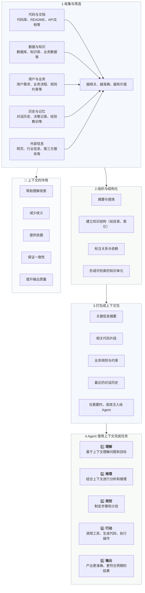

## AI Agent 流程

- **规划模块：任务的大脑与指挥官**
  - **任务分解**：将大目标拆解为小步骤。(连接数据/按产品和地区分类/计算环比增长率/生成可视化图表)
  - **反思与调整**：Agent 会评估每一步行动的结果。(若失败了，它会反思原因，并调整计划。)
- **记忆模块：经验的笔记本**
  - **短期记忆**：记住当前对话的上下文，确保回答不跑题。
  - **长期记忆**：将重要的交互信息、学到的知识存储到数据库或向量数据库中，供未来查询和使用，实现越用越聪明。
- **工具调用模块：灵活的双手**
  - 搜索（联网查询）
  - 代码执行（运行执行）
  - 数据库（数据库操作）
  - API 调用（外部服务）
  - ...
- **自我调整**：根据反馈优化策略
- **持续执行**：直到完成任务或遇到无法解决的问题

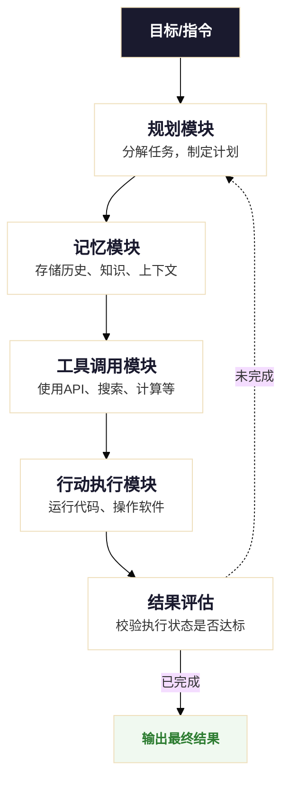

## Agent vs 传统 AI 模型

| 维度         | 传统 AI 模型         | AI Agent                              |
| ------------ | -------------------- | ------------------------------------- |
| **交互方式** | 单次输入输出         | 多轮对话、持续交互                    |
| **决策能力** | 基于输入直接推理     | 规划、反思、迭代优化、bug修复         |
| **工具使用** | 无法主动调用外部工具 | 可调用搜索、查询知识库、计算器、API等 |
| **记忆机制** | 仅限当前上下文       | 短期+长期记忆                         |
| **目标导向** | 完成单一预测任务     | 完成复杂目标                          |
| **错误处理** | 输出即结束           | 可自我纠错、重试                      |

## 从 Prompt 到 Reasoning Loop

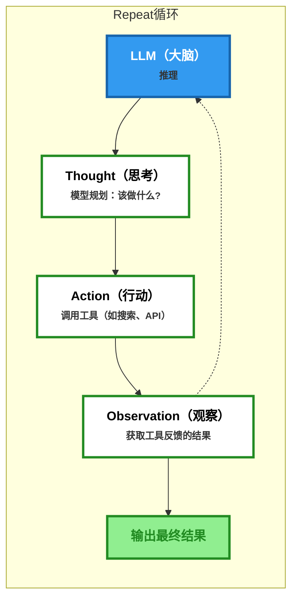

📚 Reasoning Loop详解

- **Thought (思考)**： 模型描述当前要做什么，为什么要这么做。
- **Action (行动)**： 模型选择一个工具（如：Google Search）。
- **Observation (观察)**： 模型读取工具返回的结果。
- **Repeat (循环)**： 重复上述步骤，直到得出最终答案。

## 常见挑战与局限性

:::danger[幻觉问题 (Hallucination)]
Agent 可能生成看似合理但实际错误的信息，需要通过检索增强和验证机制来降低风险。
:::
:::danger[边界失控 (Scope Creep)]
自主性过高可能导致 Agent 执行超出预期范围的操作，需要设置明确的权限边界。
:::
:::danger[成本控制]
多轮迭代调用 LLM 和工具会产生较高成本，需要优化调用策略和缓存机制。
:::
:::danger[安全与隐私]
Agent 可能访问敏感数据，需要实施严格的访问控制和审计机制。
:::

## 最佳实践

:::note[渐进式自主]
从简单任务开始，逐步增加 Agent 的自主权限，循序渐进。
:::
:::note[人工监督]
关键决策节点设置人工审核，平衡效率与安全性。
:::
:::note[持续评估]
建立完善的评估指标体系，定期测试和优化 Agent 表现。
:::
:::note[容错机制]
实现重试、降级、告警等机制，确保系统稳定性。
:::
:::note[权限控制]
手动控制 Agent 的权限，手动审批、自动审批、完全控制等
:::

## 未来发展趋势

:::tip[多模态交互深化]
Agent 将更好地整合视觉、听觉、触觉等多模态感知能力，实现更自然的人机交互。
:::
:::tip[多 Agent 协作系统]
多个专业 Agent 协同工作，形成类似"AI 团队"的组织架构，处理复杂任务。
:::
:::tip[边缘计算部署]
轻量化 Agent 将在手机、IoT 设备等边缘侧运行，实现本地化智能服务。
:::
:::tip[垂直领域深耕]
医疗、法律、金融等专业领域的 Agent 将具备更强的领域知识和推理能力。
:::

## 资源文献

- [AI Agent(智能体) 教程](https://www.runoob.com/ai-agent/ai-agent-tutorial.html)
- [AI Agent 简介](https://www.runoob.com/ai-agent/ai-agent-intro.html)
