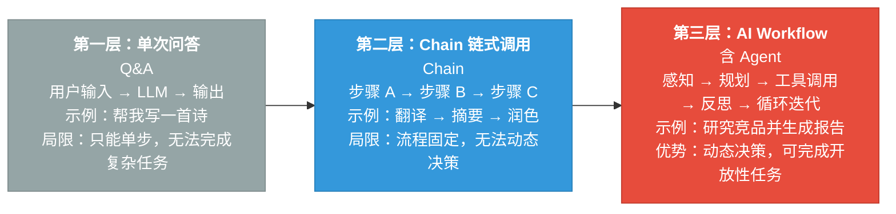
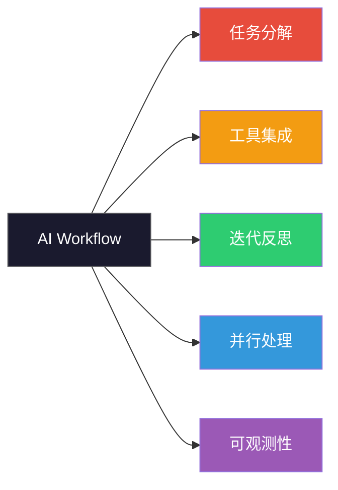

## 本节导读

<div class="sg-card">
  <div class="sg-body">
    <div class="sg-item">
      <div class="sg-item-head">
        <div class="sg-item-icon">🎯</div>
        <div class="sg-item-label">学习目标</div>
      </div>
      <div class="sg-tags">
        <span class="sg-tag">能力三层次</span>
        <span class="sg-tag">Workflow 模式</span>
        <span class="sg-tag">核心要素</span>
        <span class="sg-tag">框架选型</span>
      </div>
    </div>
    <div class="sg-item">
      <div class="sg-item-head">
        <div class="sg-item-icon">⏱️</div>
        <div class="sg-item-label">预计阅读</div>
      </div>
      <div class="sg-time">
        <span class="sg-time-num">8</span>
        <span class="sg-time-unit">min</span>
      </div>
    </div>
    <div class="sg-item">
      <div class="sg-item-head">
        <div class="sg-item-icon">📦</div>
        <div class="sg-item-label">你将收获</div>
      </div>
      <ul class="sg-list">
        <li>理解 AI Workflow 的三个能力层次与演进逻辑</li>
        <li>掌握六种常见 Workflow 模式及其适用场景</li>
        <li>学会用决策树选择合适的编排框架</li>
      </ul>
    </div>
  </div>
</div>

## AI 能力的三个层次

AI 的能力是逐步「进化」出来的：从**单次问答**，到 **Chain 链式调用**，再到 **AI Workflow（含 Agent）**，每进一层，AI 能完成的任务就越复杂。



| 名称                        | 工作方式                                 | 典型示例           | 局限 / 优势                   |
| --------------------------- | ---------------------------------------- | ------------------ | ----------------------------- |
| **单次问答 Q&A**            | 用户输入 → LLM → 输出                    | 帮我写一首诗       | ❌ 只能单步，无法完成复杂任务 |
| **Chain 链式调用**          | 步骤 A → 步骤 B → 步骤 C                 | 翻译 → 摘要 → 润色 | ❌ 流程固定，无法动态决策     |
| **AI Workflow（含 Agent）** | 感知 → 规划 → 工具调用 → 反思 → 循环迭代 | 研究竞品并生成报告 | ✅ 动态决策，可完成开放性任务 |

:::tip[💡 注意]
**AI Workflow 是当前 AI 应用落地的主要范式，也是 AI Agent 的实现基础。**
:::

## 为什么需要 AI Workflow

### 单次调用的局限

一次 LLM 调用能完成的事情非常有限：

- **上下文窗口有限**：无法一次读完一本书
- **无法访问实时信息**：训练数据有截止日期
- **无法执行操作**：不能真正发邮件、写代码并运行
- **无法自我校验**：生成错误后无法意识到并修正
- **复杂任务容易出错**：一步做太多事情导致质量下降

### AI Workflow 解决的五大核心问题



|   核心问题   | 解决方式                                     | 典型示例                           | 价值                       |
| :----------: | :------------------------------------------- | :--------------------------------- | :------------------------- |
| **任务分解** | 将复杂任务拆解为多个小步骤，每步专注一件事   | 写报告 → 调研 + 大纲 + 撰写 + 审校 | 提升准确率，降低单步压力   |
| **工具集成** | 调用搜索、数据库、代码执行器、API 等外部能力 | 搜索引擎、计算器、数据库、邮件服务 | 突破知识边界，连接真实世界 |
| **迭代反思** | AI 检验自身输出，发现问题后重新尝试修正      | 生成代码 → 运行 → 报错 → 修复      | 自动纠错，质量更有保障     |
| **并行处理** | 多个子任务同时执行，不必排队等待前一步       | 同时分析财务、技术、市场三维度     | 大幅提升效率，节省运行时间 |
| **可观测性** | 每一步的输入输出都可被记录、监控和调试       | 日志、追踪、错误定位               | 生产级别可靠，便于排查问题 |

## 核心组成要素

一个完整的 AI Workflow 由以下核心要素构成。

```mermaid
flowchart TB
    C["<b style='color:#fff'>AI</b><br/><b style='color:#fff'>Workflow</b><br/><span style='color:#aaa'>编排引擎</span>"]

    N1["<b style='color:#c0392b'>LLM/模型</b><br/><span style='color:#777'>GPT/Claude/Gemini/Codex/Deepseek<br/>Workflow 的大脑</span>"]
    N2["<b style='color:#e67e22'>工具/Tools</b><br/><span style='color:#777'>搜索、代码执行<br/>数据库、外部 API<br/>与外部交互</span>"]
    N3["<b style='color:#27ae60'>记忆/Memory</b><br/><span style='color:#777'>短期：对话历史<br/>长期：向量数据库<br/>跨会话持久化</span>"]
    N4["<b style='color:#2980b9'>状态/State</b><br/><span style='color:#777'>任务进度、中间<br/>结果、上下文传递<br/>如同接力棒</span>"]
    N5["<b style='color:#8e44ad'>人工介入</b><br/><span style='color:#777'>审核、反馈<br/>纠正、授权<br/>高风险操作暂停</span>"]
    N6["<b style='color:#d35400'>路由/条件</b><br/><span style='color:#777'>根据条件决定<br/>走哪条执行路径<br/>分支、循环、跳转</span>"]
    N7["<b style='color:#2c3e50'>输入/输出</b><br/><span style='color:#777'>文本、图像、文件<br/>结构化数据</span>"]

    C --- N1
    C --- N2
    C --- N3
    C --- N4
    C --- N5
    C --- N6
    C --- N7

    style C fill:#1a1a2e,stroke:#1a1a2e
    style N1 fill:#fdecea,stroke:#e74c3c
    style N2 fill:#fef5e7,stroke:#f39c12
    style N3 fill:#eafaf1,stroke:#2ecc71
    style N4 fill:#eaf4fb,stroke:#3498db
    style N5 fill:#f5eafb,stroke:#9b59b6
    style N6 fill:#fef5e7,stroke:#e67e22
    style N7 fill:#ecf0f1,stroke:#2c3e50
```



> 📌 各组件由编排引擎（LangChain / LlamaIndex / Dify 等）统一调度协作。

## 常见 Workflow 模式

### 顺序链（Sequential Chain）

:::tip[顺序链]
最基础的模式，步骤 A → B → C 线性执行，上一步输出是下一步输入。每步输出自动成为下一步的输入，线性流转，逻辑清晰。

:::

### 条件路由（Conditional Routing）

:::tip[条件路由]
根据某一步的输出内容，动态选择不同的后续路径。路由节点根据问题类型，将任务派发给最合适的处理分支。

:::

### 并行执行（Parallel Execution）

:::tip[并行执行]
多个子任务同时执行，不必排队等待前一步，最后汇总结果。

:::

### ReAct 循环（Reason + Act）

:::tip[ReAct 循环]
AI 先推理决定做什么，再行动调用工具，根据结果继续推理，循环直到任务完成。每轮"思考→行动→观察"不断积累信息，直到 LLM 认为已可作出最终回答

:::

### Plan & Execute（先规划后执行）

:::tip[Plan & Execute]
先让 LLM 制定完整计划，再按计划逐步执行。Planner 只用一次 LLM 调用制定全局计划，后续各步骤严格按计划执行

:::

### 多智能体协作（Multi-Agent）

:::tip[多智能体协作]
多个专职 Agent 分工合作，每个 Agent 有自己的角色和工具集。各 Agent 专精一项技能，协调者统筹全局，分工合作效率远超单一 Agent。

:::

## 主流框架与工具对比

以下是当前最主流的 AI Workflow 框架全景对比，帮助你根据自身情况做出选择。

| 框架                       | 定位                            | 核心特点                                                              | 适合人群                                     | 学习曲线 |
| -------------------------- | ------------------------------- | --------------------------------------------------------------------- | -------------------------------------------- | -------- |
| **LangChain**（Python/JS） | 代码优先框架（最完整生态）      | Chain、Agent、RAG 全覆盖工具集成数量最多（200+）LangSmith 可观测平台  | 有 Python 基础的开发者需要大量自定义集成     | 中等     |
| **LangGraph**（LangChain） | 图状 Agent 框架（有状态工作流） | 用「图」定义复杂工作流内置状态管理、断点续传支持 Human-in-the-Loop    | 需要复杂流程控制的场景生产级 Agent 应用      | 较难     |
| **LlamaIndex**（Python）   | RAG 专精框架（数据处理最强）    | 数据摄入、索引、检索最优支持 80+ 数据源连接器高级 RAG 策略内置        | 知识库、文档问答场景需要接入大量非结构化数据 | 中等     |
| **Dify**（开源 LLMOps）    | 可视化低代码（全栈 AI 平台）    | 拖拽构建 Workflow，无需写代码内置应用管理、API 发布支持自托管和云端   | 非技术背景用户快速原型到生产部署             | 最低     |
| **n8n**（自动化平台）      | 通用工作流自动化（含 AI 节点）  | 400+ 服务集成，可视化编排AI 节点 + 传统自动化混合可自托管，数据不出境 | 需要连接各类 SaaS 系统业务流程自动化场景     | 较低     |
| **CrewAI**（Python）       | 多 Agent 协作（角色扮演框架）   | 以「角色」和「任务」定义 Agent内置委托、监督机制API 极简，上手快      | 多 Agent 协作场景有 Python 基础的入门者      | 较低     |

> 💡 新手推荐：有代码基础 → LangChain / CrewAI；非技术背景 → Dify / n8n。

### 框架选型决策树

根据你的具体情况，按照以下决策树选择合适的框架：

```txt
你的情况是什么？
│
├─── 没有编程基础，想用可视化工具搭建
│    ├─── 主要是 AI 应用（问答、生成）→ Dify（首选）
│    └─── 需要连接 Slack/邮件等 SaaS 系统 → n8n
│
├─── 有 Python 基础，代码优先
│    ├─── 做知识库 / RAG 系统 → LlamaIndex
│    ├─── 做多 Agent 协作，想快速上手 → CrewAI
│    ├─── 需要复杂有状态流程控制 → LangGraph
│    └─── 通用场景，想要最大生态 → LangChain
│
└─── 已有明确场景，生产级要求
     ├─── 高并发、精细控制 → LangGraph + LangSmith
     └─── 企业部署、私有化 → Dify 自托管
```

## 其他

### Claude Code

- **需求分析** - AI 辅助拆解PRD（plan模式），生成技术方案
- **架构设计** - AI 提供模型对比，开发者自己做决策
- **编码** - Claude Code 编程
- **测试** - AI 自动生成 +E2E测试
- **交付** - AI 生成文档，CHANGELOG

### CLAUDE.md 规则

✅ 核心原则：精简 + 分层

- 必读层：CLAUDE.md 只写架构概览 + 代码规范（控制在 ~150行）
- 导航层：docs/README.md，标注 ”Read first” vs ”Read based on task”
- 选读层：按功能/领域拆分详细文档，AI 按任务需要才读

:::danger[错误写法]
❌ 把所有文档塞进一个文件 -> 每次对话烧大量Token，AI 找不到重点
:::
