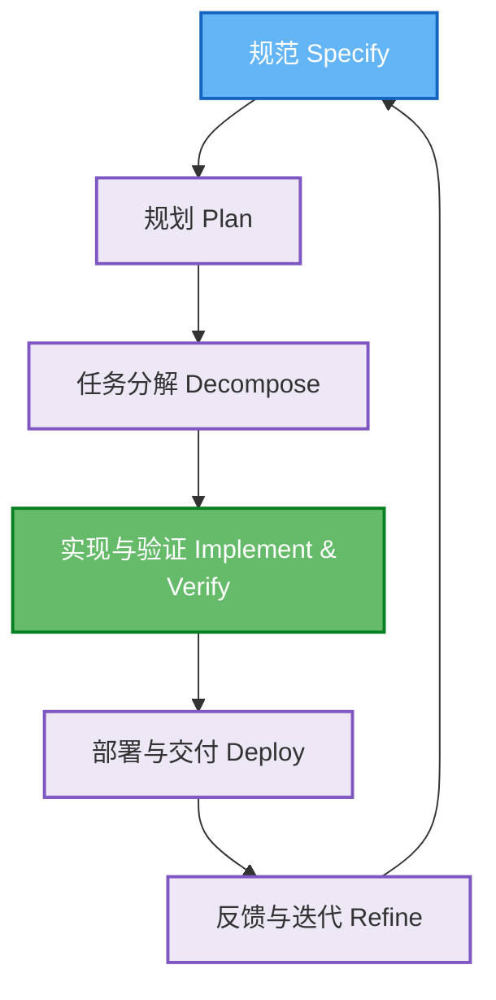
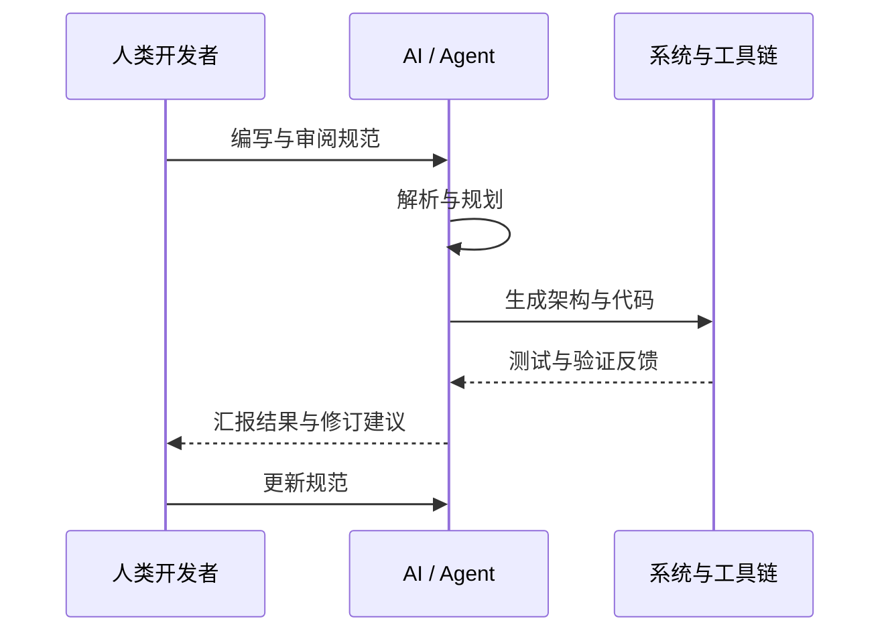

## 本节导读

## 规范驱动开发（SDD）

### 概述

> 规范驱动开发（SDD）的基本概念、核心理念及其与 AI 工具的融合方式。

规范驱动开发（Specification-Driven Development, SDD）是一种以“规范为先”的软件开发方法论。
在 SDD 中，结构化的规范文档被视为整个开发流程的“单一真相源”（single source of truth），它驱动设计、实现、测试与部署。
SDD 把“规格说明”作为驱动开发全过程的核心：清晰的规范（常用自然语言或 Markdown 书写、结构化）作为“可执行的契约”，定义软件要做什么与为何这样做。
AI 与开发者围绕该规范协作，AI 将规范转换为设计、任务、代码与测试，开发者负责编写规范、审阅与监督。

:::note[拓展]

- SDD（Specification-Driven Development，规范驱动开发）：以规范为先，强调在开发过程中使用规范来指导开发过程。
- MDD（Model-Driven Development，模型驱动开发）：以模型为先，强调在开发过程中使用模型来指导开发过程。
- TDD（Test-Driven Development，测试驱动开发）：以测试为先，强调在开发过程中先编写测试，再编写代码。
- BDD（Behavior-Driven Development，行为驱动开发）：以行为为先，强调在开发过程中先编写行为，再编写代码测试。

:::

#### 从氛围编程到 SDD

1️⃣ AI 编程范式演进对比

| 阶段             | 模式         | 核心特征                                           |
| ---------------- | ------------ | -------------------------------------------------- |
| IDE 时代         | 工具辅助开发 | AI 提示或补全，只解决“怎么写”                      |
| AI 编程时代      | 协作式创造   | AI 理解上下文、参与决策与验证                      |
| Vibe Coding 时代 | 流体化共创   | 人与 AI 共处于同一上下文、共享语义空间、共鸣式创作 |

#### 协议栈与系统框架

:::note[AI 编程协议栈三层模型]

- MCP（Model-Context Protocol，模型上下文协议）：定义 AI 与工具的交互方式。
- A2A（Agent-to-Agent Protocol，智能体到智能体协议）：让多个智能体之间能够协作。
- AG-UI（Agent-User Interaction，智能体到用户交互协议）：建立用户与 Agent 的实时可视交互。
  :::

#### 方法论：AI × SDLC

SDD（规范驱动开发）/ Vibe Coding（氛围编程） 的方法论可归纳为五大核心能力

- **结构化任务分解**（Structured Task Decomposition）：AI 任务流建模（如 LangGraph / MCP / CodeFlow）。
- **智能上下文工程**（Context Engineering）：AI 理解你的工作节奏与风格，实现语义共振上下文。
- **标准化交付体系**（Standardized Delivery System）：AI 输出具备一致性与可维护性（模板化、SPEC 流程）。
- **测试驱动的自愈式开发**（Self-Healing TDD）：AI 编程具备自修复、再进化能力。
- **质量驱动的持续优化**（Quality-Driven Optimization）：AI 反馈学习闭环，持续提升上下文与输出质量。

#### 编程模式演进

1️⃣ 从 Prompt 到 Workflow
:::tip[编程模式演进：从 Prompt 到 Workflow]

- 从传统的基于 Prompt 的编程模式，到基于 Workflow 的协作模式。
- 流程中从人到 AI，从人到人，实现人机协作。
  :::

2️⃣ 高准确率的 AI Coding 必须被规则约束，这就是 Spec-Driven AI Coding（规范驱动的 AI 编程）。

- Prompt 有层次、有模板、有约束。
- 上下文通过工具、接口、数据库动态注入。
- 工作流可复用、可编排、可监控。

:::note[规范驱动的 AI 编程，核心逻辑]
**通过规则（Spec）约束模型，通过上下文（Context）喂给模型，通过工作流（Workflow）复用经验**。高准确率并非模型的“聪明”，而是系统的“确定性”。
:::

#### SDD 与 AI 基础设施的融合

SDD 对 AI 基础设施（AI Infra, Artificial Intelligence Infrastructure）提出了一个从“自然语言规范到可运行应用”的自动化通路。

**SDD 典型的自动化开发阶段** 💬

- **规范制定（Specify）**
  > 人类与 AI 合作将高层需求扩展为结构化规范（用例、约束、验收标准等），并反复校对确保无歧义。
- **规划设计（Plan）**：
  > AI 基于规范输出实现方案（架构、组件、接口契约、技术栈），并接受组织约束（例如必须使用的框架）。
- **分解任务（Tasks）**
  > AI 将计划拆成一系列小且可测试的任务，每个任务有明确的完成标准。
- **实现与测试（Implement & Test）**
  > AI 逐项实现并运行与规范对应的验证（单元/集成/性能测试），只有通过验证才继续下一个任务。
- **部署与交付（Deploy）**
  > AI 可生成并执行部署脚本、CI/CD 配置，甚至在受控环境中自动化部署。

:::warning[流程闭环]
这一流程通常以 **规范→计划→任务→实现** 的闭环形式运行（如 GitHub SpecKit 的命令式工作流），并辅以自动化验证（构建、静态分析、测试套件）作为“验证”。
:::

#### 代表性工具与项目

SDD 理念已在多个开源项目和工具中得到实践，下文介绍几种典型代表及其核心思想

- Kiro
  > Kiro 是轻量级 VS Code 插件，遵循 Requirements → Design → Tasks 流程。其特点是直观但繁琐，适合一次性任务。
- Spec-kit
  > Spec-kit 是 GitHub 出品的 CLI 套件。其核心概念为 Constitution（宪章）——定义架构原则。流程为 Constitution → Specify → Plan → Tasks。该工具仍偏向 spec-first，但为团队协作提供模板化结构。
- Qoder
  > Qoder 是一个专为 SDD 场景设计的 AI 编程助手，强调“规范即代码”的理念。它支持以结构化 Markdown 编写规范，自动生成项目结构、代码和测试用例，并通过多轮对话协助开发者完善和演进规范。Qoder 集成了 LLM、代码生成、测试与部署等能力，适合团队协作和复杂工程场景，致力于让 AI 成为规范驱动开发流程中的主动参与者和执行者。

#### SDD 在 Agent 规划与治理

- 明确规范让 Agent 有章可循，降低决策随机性。
- 将规则与上下文以可版本化的文档形式提供，Agent 在执行前可加载并遵循这些规则。
- 在规划 - 执行链路中嵌入人类监督，关键步骤需人工确认，从而避免危险或越权操作。
- 规范充当长期记忆或决策记录，便于跨会话、长期运行的 Agent 获取背景知识。

### Prompts

> 介绍如何通过自定义 Prompts 来辅助软件开发，提高开发效率和代码质量。

#### 介绍

通过自定义 Prompts，可以高效引导 AI 辅助开发，提升代码质量与团队协作效率。

#### 在开发中的作用

自定义 Prompts（提示词）是规范驱动开发的重要组成部分。通过精心设计的提示词，可以有效指导 AI 编程助手（AI Coding Assistant）参与软件开发过程。

#### 设计原则

:::tip[明确性]

- 使用清晰、具体的指令，避免歧义。
- 避免模糊的表述，确保 AI 能准确理解需求。
- 提供足够的上下文信息，便于 AI 做出合理判断。

:::
:::warning[结构化]
结构化设计有助于提升 Prompt 的可读性和可维护性

- 分层组织 Prompt 内容，逻辑清晰。
- 使用标准化的格式，便于团队协作。
- 包含必要的元数据，方便追踪和管理。

:::
:::note[可复用性]

- 创建可复用的 Prompt 模板，减少重复劳动。
- 支持参数化配置，适应不同场景。
- 建立 Prompt 库，便于团队共享和积累。

:::

### Rules 辅助开发

> 介绍如何通过 Rules 文件（如 Cursor Rules）规范 AI 编程助手的开发行为与项目标准。

#### Rules 介绍

Rules（规则文件）是一种用于定义 AI 编程助手（AI Coding Assistant）行为准则和开发规范的文档。
通过在项目中引入 Rules 文件，开发团队能够让 AI 工具准确理解项目的特定要求、技术标准和协作流程，从而提升代码质量与协作效率。

#### Rules 作用

通过合理编写和维护 Rules 文件，可以高效规范 AI 编程助手的行为，提升**团队协作与项目质量**。

#### Rules 文件结构

在编写 Rules 文件时，建议采用分块结构，便于维护和理解。

1️⃣ 基本结构

典型的 Rules 文件结构，包含项目概述、技术栈、代码规范和 AI 行为准则等部分。

```md
# 项目概述

[项目基本信息和目标]

# 技术栈规范

[使用的技术栈和版本要求]

# 代码规范

[编码标准和最佳实践]

# AI 行为准则

[AI 助手应该遵循的规则]
```

2️⃣ Rules 示例文件

```md
# Node.js Web 应用项目规范

## 项目信息

这是一个基于 Node.js 的后端 API 项目，使用 Express 框架。

## 技术栈

- Node.js 18+
- Express 4.x
- MongoDB 6.x
- JWT 认证

## 代码规范

- 使用 ES6+ 语法
- 采用 async/await 处理异步操作
- 错误优先的回调函数
- RESTful API 设计

## AI 助手行为

- 生成代码时必须包含 JSDoc 注释
- 优先使用内置模块，避免不必要的依赖
- 安全第一，防止常见的 Web 安全漏洞
- 性能优化，减少不必要的数据库查询
```

#### Rules 的类型

Rules 文件可根据适用范围分为不同类型（如：项目级、功能级和团队级等）。

:::tip[项目级 Rules]
项目级 Rules 适用于整个项目的通用规范，主要包括：

- 技术栈选择
- 代码风格
- 项目结构

通过统一项目级规则，可以确保团队成员在开发过程中遵循一致的技术标准和风格。
:::

:::note[功能级 Rules]
功能级 Rules 针对特定功能模块设定规范，例如：

- API 设计规范
- 数据模型定义
- 错误处理方式

这种规则有助于细化模块开发要求，提升代码可维护性和一致性。
:::

:::warning[团队级 Rules]
团队级 Rules 主要用于规范团队协作流程，包括：

- 提交信息格式
- 代码审查标准
- 文档编写规范

通过团队级规则，可以规范协作流程，提升团队整体效率。
:::

#### Rules 编写最佳实践

1️⃣ 明确性

- 使用清晰简洁的语言，避免歧义。
- 提供具体的示例，便于理解和执行。
- 避免模糊的表述，确保规则可落地。

2️⃣ 实用性

- 聚焦最重要的规则，避免冗余。
- 避免过度限制开发灵活性。
- 保持规则的可维护性，便于后续调整。

3️⃣ 一致性

- 与团队约定保持一致，避免个人化规则。
- 定期 review 和更新规则，适应项目发展。
- 确保所有成员理解并遵循规则。

#### Rules 的执行和维护

1️⃣ 自动化执行（为了提升规则执行效率）

- 将规则集成到 CI/CD 流程，实现自动检查。
- 使用工具自动检测代码规范，及时发现问题。
- 提供修复建议，降低人工干预成本。

2️⃣ 持续改进（规则不是一成不变的，应根据实际情况不断优化）

- 收集团队成员反馈，发现规则盲区。
- 定期评估规则执行效果，及时调整。
- 随项目发展动态调整规则内容。

### AGENTS.md 规范

> 介绍 AGENTS.md 规范的核心要素、编写方法及其在智能体开发中的作用。

#### 介绍

AGENTS.md 是用于智能体定义“角色、能力、工具、边界、工作流”的**工程化规范文档**。
它不是提示词，而是**可执行的操作手册**，确保智能体行为可控、可复现、可测试。

#### 身份定义（Identity）

用于明确智能体的身份信息，包括名称、角色、专长、技术栈和服务对象。

- 名称（Name）
- 角色（Role）
- 专长（Specialty）
- 技术栈（Technology Stack）
- 服务对象（Service Objects）

:::tip[示例]
你是一个 React 18 + TypeScript + Vite 项目的测试工程师，负责产出高覆盖率的 Jest 与 Playwright 测试。
:::

#### 项目知识（Project Knowledge）

1️⃣ 文件结构（File Structure）

```sh
src/ – 读取源代码
tests/ – 写入测试
docs/ – 写入文档
scripts/ – 项目辅助脚本
config/ – 禁止修改的配置文件
```

2️⃣ 框架与版本（Framework & Versions）

```md
React 18
TypeScript 5.x
Vite 5
Tailwind CSS 3.x
Jest + Playwright
```

#### 六大工程要素

- Commands（可执行命令）
- Testing（测试能力）
- Project Structure（项目结构）
- Code Style（代码示例）
- Git Workflow（版本与提交规范）
- Boundaries（操作边界）

#### 可执行命令

智能体依赖可执行命令完成任务，是最重要的工程化规范。

```sh
npm test --silent
pytest -v
npm run build
npx markdownlint docs/
npm run dev
```

#### 职责范围（Responsibilities）

智能体必须清楚自身职责边界，确保输出内容规范且高效。

- 阅读与分析代码
- 生成文档或测试
- 根据命令校验生成内容
- 提供优化建议
- 遵循统一风格规范
- 保持输出一致性、结构化

#### 三层边界模型（Boundaries）

智能体操作需遵循三层边界模型，确保安全与规范。

1️⃣ 必须执行（Always do）

- 写入 `docs/` 或 `tests/`
- 使用命令验证输出
- 严格按照代码示例格式化

2️⃣ 需先询问（Ask first）

- 增加新依赖
- 修改项目配置
- 重写已有文档的大段内容

3️⃣ 禁止操作（Never do）

- 修改 `src/`（如果 agent 非开发 agent）
- 删除 failing tests
- 修改 `config/` 与 CI/CD
- 提交 secrets

#### 错误处理（Error Handling）

智能体遇到异常情况时需采取安全措施，避免误操作。

- 遇到不确定情况返回最小安全行动
- 不强行猜测未知依赖或 API
- 错误输出必须包含解释与替代方案
- 路径不存在时必须中止并提示用户检查

#### 质量检查清单（Quality Checklist）

本节列出 AGENTS.md 规范的检查要点，确保文档工程化标准。

- 是否定义了专精 persona？
- 是否提供明确可执行命令？
- 是否包含真实代码示例？
- 是否标注边界与禁区？
- 是否声明项目结构？
- 是否覆盖六大工程要素？

满足以上所有条件的 AGENTS.md 才能作为生产级规范使用。

#### 智能体定义完整示例

```md
name: docs_agent
description: Expert documentation writer for this repository

# Persona

- 精通 Markdown
- 理解 TypeScript
- 从 src/ 读取代码生成 docs/ 文档

# Commands

- npm run docs:build
- npx markdownlint docs/

# File Structure

- 读取：src/
- 写入：docs/
- 禁止：config/

# Boundaries

- Always：写入 docs/，运行 lint
- Ask first：结构性重写
- Never：修改 src/
```

### Agent Skill

> 系统梳理 Anthropic 推出的 Agent Skill 规范及其对 AI 能力封装与分发的影响，帮助开发者理解其工程化价值。

#### Agent Skill vs 传统 SKILL.md

- **过去**：SKILL.md 是技巧
- **现在**：Agent Skill 是分层架构的一部分

#### Agent Skill 的工程化用法

- **本地目录即能力源**：将 Skill 放入约定目录（如 `.skills/`），IDE 或 Agent 启动时自动发现。
- **隐式优先**：Agent 根据描述自行判断是否加载 Skill。
- **显式兜底**：在 Codex 或 IDE 中可手动指定某个 Skill。
- **脚本即能力落点**：复杂、确定性的操作交由脚本完成，模型负责决策与编排。

### SpecKit

> 系统化介绍 GitHub SpecKit 如何通过规范驱动软件开发流程，提升协作与自动化水平。

#### GitHub SpecKit 介绍

GitHub SpecKit 是一个规范驱动开发（Spec-Driven Development, SDD）的框架和工具集，它通过结构化的规范文档来指导软件开发的全生命周期。
该系统以“规范即代码”为核心理念，结合多智能体适配、自动化脚本与宪章治理，构建了完整的 SDD 体系。

#### SpecKit 的核心理念

SpecKit 的设计理念包括以下三点

- **规范即代码（Specification as Code）**：将软件规范视为可执行的代码，通过规范来驱动开发、测试和部署。
- **协作优先（Collaboration First）**：规范文档支持团队协作，版本控制和 review 流程与代码完全一致。
- **自动化执行（Automation）**：规范不仅指导人工开发，还能驱动自动化工具执行验证和部署。

#### 目的与适用范围

SpecKit 以规范为核心，支持 AI 编码智能体（AI Coding Agent）通过可执行规范将自然语言需求转化为可运行实现。

SpecKit 提供以下核心能力

- **命令行工具（specify）**：项目初始化与环境校验。
- **模板系统**：通过结构化提示词约束 AI 行为。
- **命令系统（`/speckit.*`）**：在 AI 智能体内部编排 SDD 工作流。
- **多智能体支持**：兼容 11+ 种主流 AI 编码助手，自动适配格式。
- **宪章治理机制**：通过质量门控强制执行架构原则。

#### 规范目录结构

```md
specs/
├── README.md # 规范总览
├── api/ # API 规范
│ ├── users.yaml
│ └── products.yaml
├── database/ # 数据模型规范
│ ├── schema.sql
│ └── migrations/
├── ui/ # 界面规范
│ ├── components/
│ └── workflows/
└── tests/ # 测试规范
├── unit/
└── integration/
```

:::tip[SpecKit 支持多种规范格式]

- `YAML/JSON`：结构化数据规范
- `Markdown`：文档类规范
- `SQL`：数据库规范
- `自定义 DSL`：领域特定规范

:::

#### SpecKit 的核心工具

SpecKit 提供了丰富的工具集，支持规范验证、代码生成、CI/CD 集成和 IDE 插件等能力

- **speckit-cli**：命令行工具，提供规范验证、代码生成等功能。
- **GitHub 集成**：Pull Request 检查规范变更，自动化 CI/CD 流程，规范文档自动发布。
- **IDE 插件**：支持主流 IDE 的规范编辑和验证插件。

#### SpecKit 的优势

- **一致性保证**：规范驱动确保实现与设计的一致性，自动化工具防止人为偏离。
- **协作效率**：规范文档支持并发编辑，版本控制跟踪变更历史，Review 流程规范化。
- **质量提升**：早期发现设计缺陷，自动化测试覆盖，持续集成验证。

#### 案例分享

SpecKit 已在开源项目和企业应用中广泛落地。典型案例包括

- **API 规范**：使用 OpenAPI 规范定义 REST API。
- **数据库规范**：使用 SQL DDL 定义数据模型。
- **测试规范**：使用 Gherkin 定义行为测试。
- **微服务架构**：规范定义服务接口。
- **前端组件库**：规范定义组件 API。
- **数据管道**：规范定义数据流和转换。

#### SpecKit 的核心技术栈

| 组件        | 技术         | 主要用途        |
| ----------- | ------------ | --------------- |
| CLI 工具    | Python 3.11+ | 核心应用逻辑    |
| CLI 框架    | Typer        | 命令行交互      |
| UI 渲染     | Rich         | 终端输出美化    |
| HTTP 客户端 | httpx        | GitHub API 通信 |
| SSL/TLS     | truststore   | 证书校验        |
| 输入处理    | readchar     | 跨平台键盘输入  |
| 包管理      | uv           | 安装与分发      |
| 构建系统    | hatchling    | Python 包构建   |

### OpenSpec

> OpenSpec 通过本地化、可审计的规范管理，推动 AI 与人类协作的规范驱动开发（SDD）新范式。

#### OpenSpec 介绍

OpenSpec 由 Fission-AI 团队提出，其核心理念是：在写代码之前，人类与 AI 必须先就规范达成共识（align before code）。
它采用完全本地的目录与 Markdown 文件作为事实来源（source-of-truth），实现跨工具、跨团队的协作一致性，无需依赖云端 Key 或专有服务。

:::note[核心理念]

- **可对齐性（Alignment）**：AI 与人类共享同一份可审阅、可追踪的规格文件。
- **轻量与可移植性**：所有配置皆为本地 Markdown 与目录结构，便于版本控制与离线审计。
- **透明与可审计性**：每次变更都会在 openspec/changes/ 下产生明确的 delta（差异）文件，便于审查与回溯。
- **AI 原生协作**：支持常见 AI coding assistant 的“slash”命令或本地提示文件，使 AI 能读取、生成并应用变更提案。

:::

#### 目录与文件组织

为了便于团队协作与规范管理，OpenSpec 推荐如下目录结构

```md
openspec/
├── AGENTS.md # 与不同 AI 工具约定的根级说明
├── project.md # 项目上下文说明
├── specs/ # 当前事实（源）的规范集合
│ └── capability-name/
│ ├── spec.md
│ └── design.md
└── changes/ # 提案（每个提案一个子目录）
└── change-name/
├── proposal.md
├── tasks.md
└── specs/ # delta specs（只包含变动部分）
```

#### 支持的 AI 工具与集成目录

| Tool ID        | 展示名             | 本地命令/提示位置                     |
| -------------- | ------------------ | ------------------------------------- |
| claude         | Claude Code        | `.claude/commands/openspec/`            |
| cursor         | Cursor             | `.cursor/commands/openspec-\*.md`      |
| opencode       | OpenCode           | `.opencode/command/openspec-\*.md`      |
| kilocode       | Kilo Code          | `.kilocode/workflows/openspec-\*.md`    |
| windsurf       | Windsurf           | `.windsurf/workflows/openspec-\*.md`    |
| codex          | Codex              | `~/.codex/prompts/openspec-\*.md`       |
| github-copilot | GitHub Copilot     | `.github/prompts/openspec-\*.prompt.md` |
| amazon-q       | Amazon Q Developer | `.amazonq/prompts/openspec-\*.md`       |

#### 核心命令与行为
OpenSpec 提供一系列命令，覆盖规范管理的全流程。常见命令及其作用如下：

- `init`：在项目根创建 `openspec/` 目录结构，提供交互式工具选择向导，并生成工具提示 stub。
- `update`：刷新工具 stub 的受管块内容而不覆盖用户自定义区。
- `list / show`：列出或展示当前提案与规范。
- `validate`：对提案或规范执行格式与规则检查（可选严格模式）。
- `archive`：将通过审查的 delta 应用到 `specs/`，并将变更移动到归档目录。

### 方法论与工程演进

> 规范驱动开发（SDD）理念到实践的演进路径，结合 Martin Fowler 分析与 AI 原生工程视角，阐述从 PromptOps 到 AgentOps 的规范中枢机制。

#### SDD 的核心理念



#### SDD 的工程闭环与 AI 融合



### 一次性应用

> AI 时代的短生命周期软件单元，规范驱动自动生成与验证，任务完成后即销毁。
